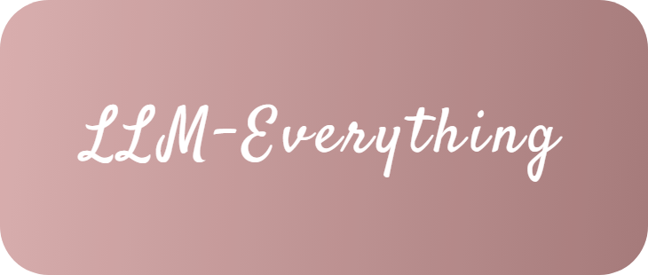

# 📃 前言

<figure><figcaption></figcaption></figure>

### 🌟在这里学习LLM，你将获得

* **超生动形象的技术讲解** ：我们摒弃了那些充斥着大量简单复制粘贴以及生硬 AI 合成内容的技术博客，每一篇技术文章都经过精心打磨，让你轻松理解复杂的知识。
* **超有料的技术实战** ：从零开始一步步实现代码，带你在实战中深入探究原理，真正掌握 LLM 的精髓。

### 📚 LLM知识地图

* **Transformer结构**
* **Prompt工程**
* **模型训练**
  * 250612 LLM精度问题：[github](train/llm-precision.md)[gitbook](train/llm-precision.md)
* **模型推理/部署**
* **知识编辑**
* **LLM应用**
* **多模态大模型**
* **LLM安全**

### 🤝 与社区一起成长

本项目正在快速迭代中。\
分享你的见解，提出你的疑问，共同进步。
