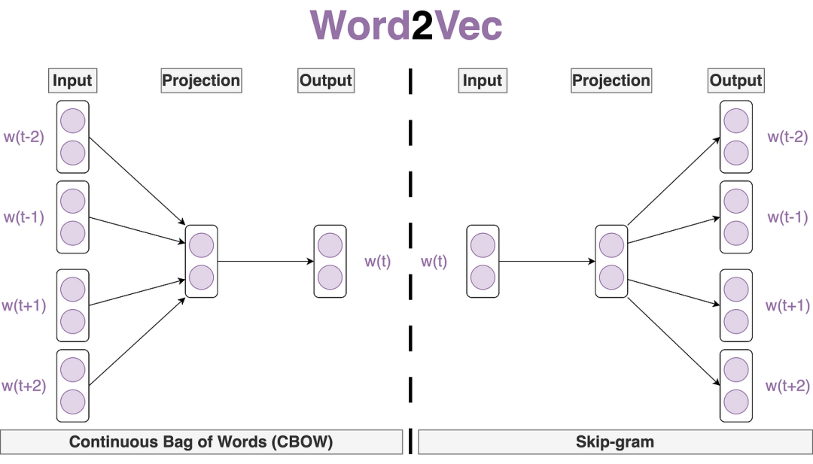
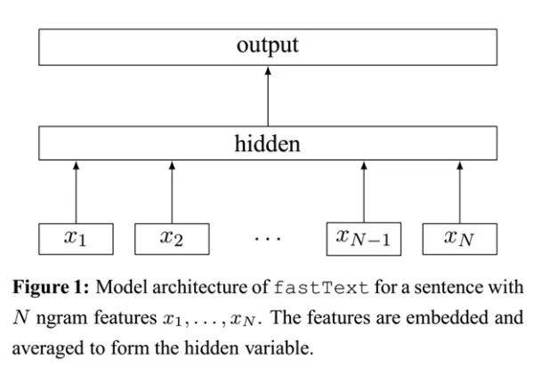

# Static Word Embeddings

## 4 基于词向量的固定表征

### 4.1 Word2Vec

<figure><figcaption><p>Word2Vec</p></figcaption></figure>

Word2Vec通过一个简单的双层神经网络来从大量文本中学习单词之间的联系。

Word2Vec有两种模型：

* Skip-gram：通过一个词预测它周围的词，即输入一个词，输出多个词。
* CBOW：通过周围的词预测中心词，即输入多个词，输出一个词。

<figure><figcaption><p>Word2Vec</p></figcaption></figure>

#### 4.1.1 CBOW

* 原理
  * CBOW通过上下文（即周围的词）来预测当前词。对输入中的多个词向量做处理（如求和或者平均）来预测目标词。
* 实现方式
  * 输入层：上下文词的one-hot编码
  * 隐藏层：通过权重矩阵将输入转为低维的密集向量
  * 输出层：使用softmax预测目标词的概率分布
* 优缺点
  * 优点：在处理大型语料库时，CBOW模型能够平滑许多分布信息，对于较小的数据集表现较好。

**4.1.1.1 CBOW的实现**

```python
import torch
import torch.nn as nn
import torch.optim as optim
```

首先创建CBOW训练使用的数据集。

```python
sentences = ["i like dog", "i love coffee", "i hate milk"]
# 构建词汇表
word_list = " ".join(sentences).split()
word_list = list(set(word_list))

# 创建one-hot映射
word_to_idx = {word: i for i, word in enumerate(word_list)}
idx_to_word = {i: word for i, word in enumerate(word_list)}

# 生成CBOW训练数据
def make_cbow_data(sentences, window_size=2):
    data = []
    for sentence in sentences:
        sentence = sentence.split()
        for idx, word in enumerate(sentence):
            # 将当前单词前后各window_size个单词作为周围词
            context = [sentence[i] for i in range(max(idx-window_size, 0), min(idx+window_size+1, len(sentence)))]
            target = word
            data.append((context, target))
    return data

cbow_data = make_cbow_data(sentences)
```

```python
# 定义one-hot编码函数
def make_one_hot_encoding(word, word_to_idx):
    # 创建一个与词汇表长度相同的全0向量
    encoding = torch.zeros(len(word_to_idx))
    # 将对应单词的位置设为1
    encoding[word_to_idx[word]] = 1
    return encoding
```

创建CBOW模型

```python
# 定义CBOW模型
class CBOW(nn.Module):
    def __init__(self, vocab_size, embedding_size):
        super(CBOW, self).__init__()
        # 从词汇表达小到隐藏层的线性层
        self.input_layer = nn.Linear(vocab_size, embedding_size)
        # 从隐藏层到词汇表大小的线性层
        self.output_layer = nn.Linear(embedding_size, vocab_size)
    
    def forward(self, X):
        # 生成嵌入
        embedding = self.input_layer(X)
        # 求平均：结合上下文信息
        embedding = torch.mean(embedding, dim=0)
        # 生成输出
        output = self.output_layer(embedding)
        return output

embedding_size = 2
cbow_model = CBOW(len(word_list), embedding_size)
```

```python
# 训练
learning_rate = 0.01
epochs = 10000
# 使用交叉熵损失
loss_fn = nn.CrossEntropyLoss()
# 使用随机梯度优化
optimizer = optim.SGD(cbow_model.parameters(), lr=learning_rate)

loss_values = []
for epoch in range(epochs):
    total_loss = 0
    for context, target in cbow_data:
        # 将上下文转换为one-hot编码
        context = torch.stack([make_one_hot_encoding(word, word_to_idx) for word in context])
        # 将目标转换为索引
        target = torch.tensor(word_to_idx[target])
        # 前向传播
        output = cbow_model(context)
        # 计算损失
        loss = loss_fn(output, target)
        total_loss += loss.item()
        # 反向传播
        optimizer.zero_grad()
        loss.backward()
        optimizer.step()
    loss_values.append(total_loss)
    if (epoch+1) % 100 == 0:
        print(f'Epoch {epoch+1}/{epochs}, Loss: {total_loss}')
```

损失函数的变化如下：

<figure><figcaption><p>CBOW-LOSS</p></figcaption></figure>

```python
# 获取嵌入
fig, ax = plt.subplots()
for word, idx in word_to_idx.items():
    embedding = cbow_model.input_layer(make_one_hot_encoding(word, word_to_idx)).detach().numpy()
    ax.scatter(embedding[0], embedding[1])
    ax.annotate(word, (embedding[0], embedding[1]))
plt.show()
```

结果如下：

<figure><figcaption><p>CBOW-EMBEDDING</p></figcaption></figure>

#### 4.1.2 Skip-gram

* 原理
  * Skip-gram通过当前词来预测周围的词。输入为一个中心词的词向量，预测该词周围一定窗口大小内的上下文词。
* 实现方式
  * 输入层：中心词的one-hot编码
  * 隐藏层：通过权重矩阵将输入转为低维的密集向量
  * 输出层：为上下文中的每个词分配概率
* 优缺点
  * 优点：在处理小数据集上表现更好，尤其是在捕捉稀有词上。通常能够学习到更好更细致的词向量表示。

**4.1.2.1 Skip-gram的实现**

Skip-gram的实现与CBOW基本类似，只是输入和输出的处理方式不同，所以这里就不再赘述。

### 4.2 fastText

#### 4.2.1 分层softmax

sigmoid函数如下：

$$
\sigma(x) = \frac{1}{1+e^{-x}}
$$

sigmoid函数的输出是一个0到1之间的数，可以看作是一个概率值。

softmax函数如下：

$$
\sigma(x)_i = \frac{e^{x_i}}{\sum_{j=1}^{n} e^{x_j}}
$$

softmax函数计算的是某一项$$x_i$$在所有项中出现的概率，分母计算时需要用到所有项的值，因此计算复杂度为$$O(n)$$。

分层softmax是一种加速softmax计算的方法，它其实就是利用多个sigmoid函数进行二分类来达到多酚类的效果。分层softmax的计算复杂度为$$O(log(n))$$。

#### 4.2.2 fastText的原理

<figure><figcaption><p>fastText</p></figcaption></figure>

fastText模型架构和word2vec中的CBOW十分类似。不同的是：

1. CBOW的输入是目标单词的上下文，而fastText的输入是多个单词及其字符级n-gram特征。word2vec把语料库中的每个单词看作一个原子单元，而fastText把每个单词看作字符级n-gram的集合。比如，对于单词`where`，fastText会考虑`<wh>`, `<he>`, `<er>`, `<re>`等n-gram特征。
2. fastText输出的是文档对应的类别，使用分层softmax来加速训练。

### 4.3 GloVe

GloVe（Global Vectors for Word Representation）与传统的词嵌入方法相比，不仅关注单词的共现次数，还考虑了单词之间的全局统计信息。

#### 4.3.1 共现矩阵

共现矩阵是一个$$V \times V$$的矩阵，其中$$V$$是词汇表的大小。矩阵的每个元素$$X_{ij}$$表示单词$$i$$和单词$$j$$在上下文中共现的次数。

共现矩阵主要用于发现主题。滑动窗口的word-word共现矩阵可以挖掘语法和语义信息，例如：

```
I like deep learning
```

设置滑动窗口为2，可以得到以下共现矩阵：

|          | I | like | deep | learning |
| -------- | - | ---- | ---- | -------- |
| I        | 0 | 1    | 0    | 0        |
| like     | 1 | 0    | 1    | 0        |
| deep     | 0 | 1    | 0    | 1        |
| learning | 0 | 0    | 1    | 0        |

#### 4.3.2 共现矩阵与条件概率

对于一个单词$$i$$，一行表示其它单词在$$i$$的上下文中出现的次数。条件概率$$P(j|i)$$表示单词$$j$$在单词$$i$$的上下文中出现的概率。

我们定义两个条件概率的比值为：

$$
ratio_{i,j,k} = \frac{P(k|i)}{P(k|j)}
$$

指的是单词$$k$$在单词$$i$$的上下文中出现的概率与单词$$k$$在单词$$j$$的上下文中出现的概率的比值。这在一定程度上反映了单词$$i$$和单词$$j$$的相似性。

$$ratio_{i,j,k}$$的普遍规律为：

|              | 单词$$j,k$$相关 | 单词$$j,k$$不相关 |
| ------------ | ----------- | ------------ |
| 单词$$i,k相关$$  | 接近1         | 远大于1         |
| 单词$$i,k不相关$$ | 远小于1        | 接近1          |

#### 4.3.3 词向量和共现矩阵的近似关系

那么，可以通过学习获得词向量，是的词向量的表征计算出来的条件概率比值接近于共现矩阵的条件概率比值。

假设$$g(w_i, w_j, \tilde{w}_k) = \frac{P(k|i)}{P(k|j)}$$，其中$$w_i, w_j, \tilde{w}_k$$分别是单词$$i, j, k$$的词向量。

损失函数是二者的均方误差：

$$
J = \sum_{i,j,k}^{N} (\frac{P(k|i)}{P(k|j)} - g(w_i, w_j, \tilde{w}_k))^2
$$

接下来需要合理推测$$g(w_i, w_j, \tilde{w}_k)$$的形式。

1. 在线性空间中考量两个单词的相似性，可以使用$$w_i - w_j$$，因此$$g(w_i, w_j, \tilde{w}_k)$$中可能包含这一项
2. $$ratio$$是一个标量，因此$$g(w_i, w_j, \tilde{w}_k)$$可能是一个内积，即$$(w_i - w_j)^T \tilde{w}_k$$
3. 由于$$ratio$$是一个比值，因此可以在外面套一层指数函数，即$$\exp((w_i - w_j)^T \tilde{w}_k)$$

因此：

$$
g(w_i, w_j, \tilde{w}_k) = \frac{P(k|i)}{P(k|j)} = \frac{exp(w_i^T \tilde{w}_k)}{exp(w_j^T \tilde{w}_k)}
$$

因此，GloVe的目标是学习一个词向量矩阵$$W$$，使得词向量之间的内积等于共现矩阵的对数值：

$$
W_i^T \tilde{W}_j + b_i + \tilde{b}_j = \log(X_{ij})
$$

其中，$$W_i$$和$$\tilde{W}_j$$分别是单词$$i$$和单词$$j$$的词向量，$$b_i$$和$$\tilde{b}_j$$是偏置项。

GloVe的损失函数为：

$$
J = \sum_{i, j=1}^{V} f(X_{ij})(W_i^T \tilde{W}_j + b_i + \tilde{b}_j - \log(X_{ij}))^2
$$

其中，$$f(X_{ij})$$是权重函数，用于平衡高频词和低频词的权重。我们希望：

* 高频共现的单词的权重要大于低频共现的单词，因此这个函数是非递减的
* 但是这个权重不应过大，在到达一定阈值后应该不再增加
* 如果两个单词没有在一起出现，则权重应该为0，它们不应该参与损失函数的计算

因此，一个常用的权重函数为：

$$
f(X_{ij}) = \begin{cases} (X_{ij}/X_{max})^\alpha & X_{ij} < X_{max} \\ 1 & X_{ij} \geq X_{max} \end{cases}
$$

除开权重函数，loss函数的其它部分则是一个标准的均方误差。

#### 4.3.3 手撕GloVe

TODO: 可以阅读mittens Glove源码

## 参考资料

1. https://www.jiqizhixin.com/articles/2018-12-03-6
2. https://zhuanlan.zhihu.com/p/568064512
3. https://zhuanlan.zhihu.com/p/79573970
4. https://blog.csdn.net/Magical\_Bubble/article/details/89160032
5. https://zhuanlan.zhihu.com/p/58389508
