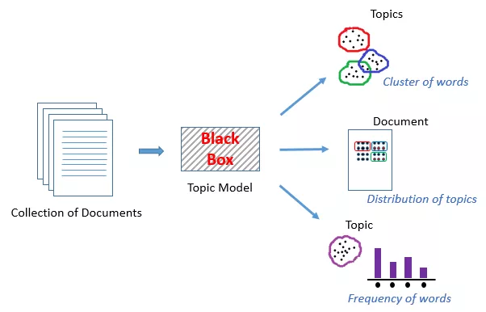
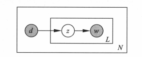

# Topic Model

## 3 主题模型

主题模型是一种特殊的概率图模型，可以识别两个不同的词或者词组是否具有相同的主题。

<figure><figcaption><p>Topic Model</p></figcaption></figure>

主题模型将相似/相关的词语聚集成簇，称为主题。

### 3.1 LSA（SVD）

潜在语义分析（Latent Semantic Analysis，LSA）是一种基于奇异值分解（SVD）的主题模型，通过降维将文本数据转换为低维的语义空间。

#### 3.1.1 奇异值分解

特征值和特征向量 对于一个矩阵$$A$$，如果存在一个非零向量$$x$$，使得$$Ax = \lambda x$$，则称$$\lambda$$为$$A$$的特征值，$$x$$为$$A$$的特征向量。

相似对角化 对于一个矩阵$$A$$，如果存在一个可逆矩阵$$P$$，使得$$P^{-1}AP = B$$，其中$$B$$是对角矩阵，则称$$A$$被$$P$$对角化。

对角矩阵指的是除了对角线上的元素外，其他元素都为0的矩阵。 如：

$$
\begin{bmatrix} 1 & 0 & 0 \\ 0 & 2 & 0 \\ 0 & 0 & 3 \end{bmatrix}
$$

但是不是所有的矩阵都可以对角化，满足矩阵可对角化的充分必要条件是：n阶矩阵$$A$$有$$n$$个线性无关的特征向量。

实对称矩阵 实对称矩阵满足以下条件：

* 矩阵关于主对角线对称，即$$a_{ij} = a_{ji}$$

例如：

$$
\begin{bmatrix} 1 & 2 & 3 \\ 2 & 4 & 5 \\ 3 & 5 & 6 \end{bmatrix}
$$

实对称矩阵的所有特征向量彼此正交，所以任何实对称矩阵都可以被正交对角化。

将矩阵$$P$$正交化，形成矩阵$$Q$$，则$$Q^TQ = I$$，即$$Q$$是正交矩阵。

$$
A = PBP^{-1} = QBQ^T
$$

奇异值分解 更一般的情况，对于一个$$m \times n$$的矩阵$$A$$，存在两个正交矩阵$$U$$和$$V$$，使得：

$$
A = U S V^T
$$

其中$$S$$是一个$$m \times n$$的对角矩阵，对角线上的元素称为奇异值。

于是，SVD将矩阵$$A$$分解为三个矩阵的乘积，可以用于降维、特征提取等。

#### 3.1.2 LSA的原理

假设我们有m篇文档，词表大小为n。我们希望从所有文档中提取出K个主题，其中K为用户输入的超参。

1.  生成一个m×n维的文档-词项矩阵（Document-Term Matrix），矩阵元素为TF-IDF分数

    <figure><figcaption><p>LSA</p></figcaption></figure>
2.  使用SVD将上述矩阵的维度降到K维

    SVD首先将矩阵$$A$$分解为三个矩阵的乘积：

    <figure><figcaption><p>LSA</p></figcaption></figure>

    由于我们只需要前K个奇异值，所以只保留前K个奇异值，并相应地截断矩阵$$U$$和$$V$$，重新构造近似矩阵。

    在这里，矩阵$$U_k$$的每个行向量代表相应的文档。矩阵$$V_k$$的每个行向量代表相应的词项。向量的长度均为K。

    因此，SVD为每篇文档和每个词项都生成了向量表示，这些向量表示可以用于计算文档之间的相似度，或者词项之间的相似度。

#### 3.1.3 手撕LSA

1.  加载数据集，使用sklearn的`fetch_20newsgroups`加载新闻数据集

    ```python
    from sklearn.datasets import fetch_20newsgroups
    dataset = fetch_20newsgroups(shuffle=True, random_state=1, remove=('header','footers',quotes'))
    documents = dataset.data
    ```
2.  数据预处理，包括去除标点符号、分词、去停用词、词干提取等

    ```python
    news_df = pd.DataFrame({'document':documents})

    # removing everything except alphabets
    news_df['clean_doc'] = news_df['document'].str.replace("[^a-zA-Z#]", " ")

    # removing short words
    news_df['clean_doc'] = news_df['clean_doc'].apply(lambda x: ' '.join([w for w in x.split() if len(w)>3]))

    # make all text lowercase
    news_df['clean_doc'] = news_df['clean_doc'].apply(lambda x: x.lower())

    from nltk.corpus import stopwords
    stop_words = set(stopwords.words('english'))

    # tokenization
    tokenized_doc = news_df['clean_doc'].apply(lambda x: x.split())

    # remove stop-words
    tokenized_doc = tokenized_doc.apply(lambda x: [item for item in x if item not in stop_words])

    # de-tokenization
    detokenized_doc = []
    for i in range(len(news_df)):
        t = ' '.join(tokenized_doc[i])
        detokenized_doc.append(t)

    news_df['clean_doc'] = detokenized_doc
    ```
3.  创建文档-词项矩阵

    使用sklearn的TfidfVectorizer创建文档-词项矩阵

    ```python
    from sklearn.feature_extraction.text import TfidfVectorizer

    vectorizer = TfidfVectorizer(stop_words='english', max_features=1000, max_df=0.5, smooth_idf=True)

    X = vectorizer.fit_transform(news_df['clean_doc'])
    ```
4.  使用SVD进行降维

    ```python
    from sklearn.decomposition import TruncatedSVD

    svd_model = TruncatedSVD(n_components=20, algorithm='randomized', n_iter=100, random_state=42)

    svd_model.fit(X)

    print(len(svd_model.components_))
    ```
5.  获取主题词

    svd\_model的组成部分是我们的主题词，我们可以通过`svd_model.components_`获取。

    ```python
    terms = vectorizer.get_feature_names()

    for i, comp in enumerate(svd_model.components_):
        terms_comp = zip(terms, comp)
        sorted_terms = sorted(terms_comp, key=lambda x:x[1], reverse=True)[:7]
        print("Topic "+str(i)+": ")
        for t in sorted_terms:
            print(t[0])
        print(" ")
    ```

    输出结果如下：

    ```
    Topic 0: like know people think good time thanks

    Topic 0: like know people think good time thanks

    Topic 1: thanks windows card drive mail file advance

    Topic 2: game team year games season players good

    Topic 3: drive scsi disk hard card drives problem

    Topic 4: windows file window files program using problem

    Topic 5: government chip mail space information encryption data

    Topic 6: like bike know chip sounds looks look

    …
    ```

#### 3.1.4 LSA的优缺点

* 优点
  * LSA快速且易于实施
  * 结果比简单的向量模型更好
* 缺点
  * LSA是线性模型，在具有非线性依赖性的数据集上效果不佳
  * LSA假设文本中的词项服从正态分布，可能不适用于所有问题
  * SVD是计算密集型的，当新数据出现时难以更新

### 3.2 pLSA

LSA的根本问题在于，尽管我们可以把$$U_k$$和$$V_k$$看作文档和词项的向量表示，但是这两个矩阵并没有明确的语义解释。pLSA（Probabilistic Latent Semantic Analysis）通过引入概率模型来解决这个问题。

#### 3.2.1 pLSA的原理

pLSA通过一个生成模型来为LSA提供概率意义上的解释。该模型假设，每篇文档都包括一系列可能的潜在主题。文档中的每个单词都不是凭空产生的，而是在这些潜在话题（即单词的概率分布）的指引下通过一定的概率生成的。

话题是单词的概率分布，文档是话题的概率分布，则单词是文档和话题的联合概率分布。

假设有M个单词集合$$W={w_1, w_2, ..., w_M}$$，N个文档集合$$D={d_1, d_2, ..., d_N}$$，K个主题集合$$Z={z_1, z_2, ..., z_K}$$。概率分布$$P(d)$$表示生成文档$$d$$的概率，$$P(w|z)$$表示在主题$$z$$下生成单词$$w$$的概率，$$P(z|d)$$表示在文档$$d$$中生成主题$$z$$的概率。

<figure><figcaption><p>pLSA</p></figcaption></figure>

则$$p(w|d)$$的推导为：

$$
p(w|d) = \sum_{z} p(w, z|d) = \sum_{z} p(w|z, d) p(z|d)
$$

整个语料库中的概率生成可以用似然函数表示：

$$
L = \prod_{d \in D} \prod_{w \in d} p(w, d)^{n_{dw}}
$$

其中，$$n_{dw}$$表示文档$$d$$中单词$$w$$出现的次数。

推导后得：

$$
L = \prod_{d \in D} \prod_{w \in d} \sum_{z} p(d) p(w|z, d) p(z|d)^{n_{dw}}
$$

其中，$$p(w|z, d)$$和$$p(z|d)$$是模型的参数，可以通过EM算法进行估计。

#### 3.2.2 手撕pLSA

```python
import numpy as np
from sklearn.feature_extraction.text import CountVectorizer
 
 
class PLSA:
    def __init__(self, num_topics, num_iterations):
        self.num_topics = num_topics
        self.num_iterations = num_iterations
        self.vocab = None
        self.num_words = None
        self.num_documents = None
        self.word_count = None
        self.P_z_given_d = None
        self.P_w_given_z = None
        self.P_z_given_dw = None
 
    def fit(self, documents):
        vectorizer = CountVectorizer()
        count_matrix = vectorizer.fit_transform(documents)
        self.vocab = vectorizer.get_feature_names_out()
        self.num_words = len(self.vocab)
        self.num_documents = count_matrix.shape[0]
        self.word_count = count_matrix.toarray()
 
        # Initialize parameters
        self.P_z_given_d = np.random.rand(self.num_documents, self.num_topics)
        self.P_w_given_z = np.random.rand(self.num_topics, self.num_words)
        self.P_z_given_dw = np.zeros((self.num_documents, self.num_words, self.num_topics))
 
        # Run EM algorithm
        for i in range(self.num_iterations):
            print(f'Iteration {i + 1}')
 
            # E-step
            for d in range(self.num_documents):
                for w in range(self.num_words):
                    denominator = np.sum(self.P_w_given_z[:, w] * self.P_z_given_d[d])
                    for z in range(self.num_topics):
                        numerator = self.P_w_given_z[z, w] * self.P_z_given_d[d, z]
                        self.P_z_given_dw[d, w, z] = numerator / denominator
 
            # M-step
            for z in range(self.num_topics):
                for w in range(self.num_words):
                    numerator = 0
                    for d in range(self.num_documents):
                        numerator += self.word_count[d, w] * self.P_z_given_dw[d, w, z]
                    self.P_w_given_z[z, w] = numerator / np.sum(self.word_count)
 
            for d in range(self.num_documents):
                for z in range(self.num_topics):
                    numerator = 0
                    for w in range(self.num_words):
                        numerator += self.word_count[d, w] * self.P_z_given_dw[d, w, z]
                    self.P_z_given_d[d, z] = numerator / np.sum(self.word_count[d, :])
 
    def transform(self, documents):
        vectorizer = CountVectorizer(vocabulary=self.vocab)
        count_matrix = vectorizer.fit_transform(documents)
        word_count = count_matrix.toarray()
        P_z_given_d = np.zeros((count_matrix.shape[0], self.num_topics))
 
        for d in range(count_matrix.shape[0]):
            for z in range(self.num_topics):
                numerator = 0
                for w in range(self.num_words):
                    numerator += word_count[d, w] * self.P_w_given_z[z, w] * self.P_z_given_d[d, z]
                P_z_given_d[d, z] = numerator / np.sum(word_count[d, :])
 
        return P_z_given_d
```

#### 3.2.3 pLSA的优缺点

* 优点
  * pLSA是一种概率模型，可以为LSA提供概率意义上的解释
  * pLSA可以更好地捕捉文档和词项之间的关系
* 缺点
  * pLSA是一种非凸优化问题，容易陷入局部最优解
  * pLSA对于数据的噪声和稀疏性敏感
  * pLSA无法处理新数据的出现

### 3.3 LDA

LDA（Latent Dirichlet Allocation）可以看作是pLSA的贝叶斯版本，它引入了Dirichlet先验分布来解决pLSA的一些问题。

#### 3.3.1 二项分布和多项分布

二项分布是N次伯努利分布，即$$X \sim B(n, p)$$。概率密度为：

$$
P(X=k) = C_n^k p^k (1-p)^{n-k}
$$

多项分布是二项分布拓展到多维的情况。多项分布是指在单次实验中的随机变量的取值不再是0和1，而是多个不同的值。多项分布的概率密度为：

$$
P(X_1=k_1, X_2=k_2, ..., X_n=k_n) = \frac{n!}{k_1!k_2!...k_n!} p_1^{k_1} p_2^{k_2} ... p_n^{k_n}
$$

其中，$$p_1, p_2, ..., p_n$$代表每个类别的概率，且$$\sum_{i=1}^{n} p_i = 1$$。

#### 3.3.2 共轭先验分布

如果后验概率$$P(\theta|X)$$和先验概率$$P(\theta)$$属于同一分布族，则称先验分布和后验分布是共轭分布。

$$
P(\theta|X) = \frac{P(X|\theta)P(\theta)}{P(X)}
$$

对于二项分布，Beta分布是其共轭先验分布。对于多项分布，Dirichlet分布是其共轭先验分布。

#### 3.3.3 Dirichlet分布

Dirichlet的概率密度函数为：

$$
Dir(\theta|\alpha) = \frac{\Gamma(\sum_{i=1}^{K} \alpha_i)}{\prod_{i=1}^{K} \Gamma(\alpha_i)} \prod_{i=1}^{K} \theta_i^{\alpha_i - 1}
$$

#### 3.3.4 为什么引入Dirichlet先验分布

pLSA采用的是频率派观点，将每篇文章对应的主题分布$$P(z|d)$$和每个主题对应的词分布$$P(w|z)$$看成未知常数，并可以求解出来。LDA采用的是贝叶斯学派的观点，认为待估计的参数（主题分布和词分布）不再是一个固定的常数，而是服从一定分布的随机变量。这个分布符合一定的先验概率分布（即Dirichlet分布），通过观测数据来更新这个分布的参数。

<figure><figcaption><p>LDA</p></figcaption></figure>

#### 3.3.3 LDA的原理

语料库的生成过程：

1. 按照先验概率$$p(d_i)$$选择一篇文档$$d_i$$
2. 从超参数$$\alpha$$的Dirichlet分布中抽样生成文档$$d_i$$的主题分布$$\theta_i$$
3. 对于文档$$d_i$$中的每个词$$w_{ij}$$：
   * 从文档$$d_i$$的主题分布$$\theta_i$$中抽样生成词$$w_{ij}$$的主题$$z_{ij}$$
4. 从超参数$$\beta$$的Dirichlet分布中抽样生成主题$$z_{ij}$$的词分布$$\phi_{z_{ij}}$$
5. 从词分布$$\phi_{z_{ij}}$$中抽样生成词$$w_{ij}$$

<figure><figcaption><p>LDA EXAMPLE</p></figcaption></figure>

在PLSA中，会使用固定的概率来抽取主题词，主题分布和词分布都是唯一确定的。而在LDA中，主题分布和词分布是不确定的，它们是服从Dirichlet分布的随机变量。

#### 3.3.4 LDA的实现

TODO：参考baidu https://github.com/baidu/Familia/wiki

## 参考资料

1. https://blog.csdn.net/mch2869253130/article/details/100629262
2. https://www.jiqizhixin.com/articles/2018-12-07-10
3. https://zhuanlan.zhihu.com/p/71027182
4. https://blog.csdn.net/zhong\_ddbb/article/details/106317068
5. https://blog.csdn.net/daishabby2486/article/details/129837268
6. https://zhuanlan.zhihu.com/p/31470216
7. https://dl.acm.org/doi/pdf/10.5555/944919.944937
