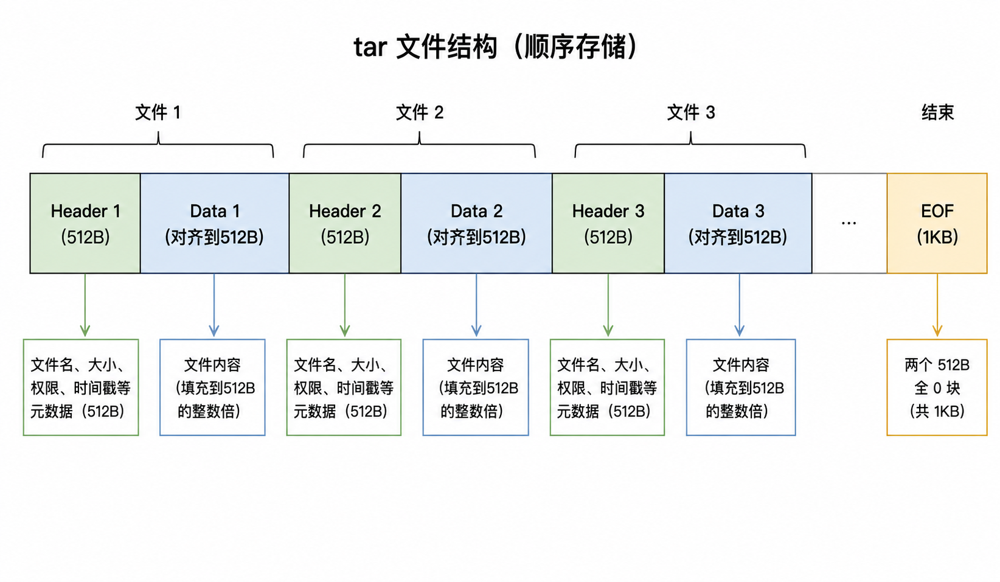

# WebDataset

## 1 顺序 I/O

训练多模态大模型时，数据集往往包含数百万到数十亿个小文件（图片、文本、点云等）。数据量大并不是问题，训练文本语言模型的时候我们也经历过tb甚至pb级别的数据量，实际的瓶颈是**访问次数太多。**

我们首先需要复习一下计算机组织原理，关于存储设备的物理原理。存储设备一般有机械硬盘（HDD）、固态硬盘（SSD）、网络存储（S3/GCS/OSS）。

### 1 计算机存储体系

#### 1.1 HDD

<figure><figcaption></figcaption></figure>

机械硬盘（HDD）可以想象成一台**唱片机，**&#x6570;据存储在磁盘的同心圆轨道（磁道）上。每个轨道被划分为若干个扇区（通常 512B 或 4KB）。磁头负责数据的读写，悬浮在盘片上方，需要物理移动到目标轨道。

读取一个文件需要三个步骤：

1. 寻道 (Seek)：磁头从当前轨道移动到目标轨道，平均耗时约 10ms
2. 旋转延迟 (Rotational Latency)：等待盘片旋转到目标扇区正好经过磁头下方，平均耗时约 4ms
3. 数据传输 (Transfer)：磁头读取经过下方的数据，顺序读约 150-200 MB/s

其中步骤1和步骤2是固定开销，与读多少数据无关。

但是假设我们需要读 100 万个小文件，每张 50KB，存储方式的不同对性能的影响很大。

如果是随机 I/O：

* 每个文件：seek(10ms) + rotate(4ms) + transfer(50KB / 150MB/s ≈ 0.3ms) = 14.3ms；
* 总时间：1,000,000 × 14.3ms = 14,300 秒 ≈ 4 小时；
* 实际带宽：50GB / 14,300s ≈ 3.5 MB/s

如果是顺序 I/O：

* 定位一次：seek(10ms) + rotate(4ms) = 14ms
* 连续读取：50GB / 150MB/s = 333 秒
* 总时间：333 秒 ≈ 5.5 分钟
* 实际带宽：≈ 150 MB/s

#### 1.2 SSD

<figure><figcaption></figcaption></figure>

SSD（Solid State Drive，固态硬盘）数据存储在 NAND 闪存芯片上，通过纯电信号访问。要修改一个 Page 中的数据，必须先擦除整个 Block（包含几百个 Page），再重新写入。SSD 比 HDD 快，核心原因有两个：

1. **无机械运动**：读任何位置的数据都是电信号寻址，不需要等磁头移动或盘片旋转
2. **多通道并行**：控制器同时从 4-8 个闪存芯片读取数据，类似 RAID 0 的效果

但是SSD仍然惧怕海量的小文件，虽然没有机械寻址的过程，但是瓶颈从硬件转移到了软件层。

每次处理一个小文件，需要有文件系统开销、NVMe 协议开销，同时随机 I/O 会导致Page Cache 效率下降。Linux 的 Page Cache 是以 4KB 页为单位缓存文件数据的。
100 万个小文件（每个 50KB）= 约 1250 万个 4KB 页。
Page Cache 的查找是 O(1) 的（基于 radix tree），
但每个文件的 Cache 是独立管理的，100 万个文件 = 100 万次独立的 Cache 查找/管理。

#### 1.3 网络存储

网络存储读取一个小文件的完整流程：

1. DNS解析
2. TCP 三次握手
3. TLS 握手
4. 发送 HTTP GET 请求
5. 服务端处理（鉴权、查找对象）
6. 传输数据
7. TCP 连接关闭

单个文件造成的延迟会被百万级的数据量放大。


总而言之，无论哪种存储介质，**顺序 I/O 都显著优于随机 I/O**。&#x20;

tar 打包的本质就是：**把小文件合并成大文件，把随机访问模式强制转换为顺序访问模式。**

### 2 tar 如何实现顺序 I/O

tar 做的事情很简单：在训练前把这海量小文件首尾相接，写成一个连续的大文件。

tar（Tape Archive）最初设计用于磁带备份，而磁带是**纯顺序设备**—— 只能从头到尾读，不能跳转。这个历史原因决定了 tar 的内部结构：

<figure><figcaption></figcaption></figure>

每个文件由两部分组成：

* **Header**（512 字节）：文件名、大小、权限、时间戳等元数据
* **Data**：文件内容，填充到 512 字节的整数倍

关键特点：

* **没有中央目录/索引**（与 zip 不同）。找到第 N 个文件的唯一方式是从头读到第 N 个
* 这正好适合流式读取——从头到尾扫一遍，遇到什么处理什么
* 512 字节对齐是因为磁带和早期硬盘的最小读写单位就是 512 字节（一个扇区）

#### 2.1 流式读取的实现细节

在 Python 中，这对应 `tarfile.open(fileobj=stream, mode="r|*")` 的流式模式：

```python
tarfile.open(fileobj=stream, mode="r|*")
```

本地文件可以进行`seek` 操作，因为任意位置都可以读，但是像 HTTP 相应流、S3 流式下载、子进程的 stdout 管道是不行的。

`r:*` 代表随机访问模式：

tar 文件本身没有中央目录（与 zip 不同），但 Python 的 `tarfile` 在 `r:*` 模式下会**预先把整个 tar 扫一遍**，把每个文件的位置（offset）记到内存里建成索引。之后就可以按名字直接跳转：

```python
tar = tarfile.open("a.tar", "r:*")
tar.getmember("xxx.jpg")    # 按名字查找 → 内部 seek 到那个位置
tar.extractfile("xxx.jpg")  # 跳过去读 → 内部又 seek 一次
```

这要求底层文件对象**必须支持 seek**。HTTP 流不支持 seek，所以这种模式根本没法用在网络流上。

`r|*` 代表流式模式：

```python
tar = tarfile.open(fileobj=stream, mode="r|*")
for member in tar:                         # 顺序遍历
    data = tar.extractfile(member).read()  # 当前条目立刻读
```

tarfile 内部只会调用 `read()` ，不调用`seek()` 。

但是天下没有免费的午餐：

流式模式使得webdataset可以从网络流直接读，不用先把整个 tar 下载到本地，也不需要预先建索引，内存占用低。但是只能从头到尾遍历一次，对象用完即弃，没法通过名字查找。

#### 2.2 处理内存泄露

`tar.members` 是 `tarfile` 对象内部维护的一个 **Python 列表**，记录"目前为止见过的所有文件条目"。每次 `for member in tar` 迭代一步，tarfile 都会把当前的 TarInfo 对象追加到这个列表里：

```python
tar = tarfile.open(fileobj=stream, mode="r|*")
for member in tar:
    # tarfile 内部相当于做了：
    #     self.members.append(member)
    process(member)
```

TarInfo 是一个小对象，存的是文件名、大小、权限、修改时间这些元数据，本身不大（几百字节）。但条目数量乘上去就可观了。

这个本来是给随机访问模式 `r:*` 设计的，因此流式模式 `r|*` 下我们不会用这份清单，所以每次 yield 之后会手动 `tar.members = []` 把列表重置为空。


## 2 Group by keys

tar 内部的文件以共享前缀的方式组织同一个样本：

```
000042.jpg
000042.txt
000042.json
```

需要将它们聚合成一个样本字典：

```python
{"__key__": "000042", "jpg": <bytes>, "txt": <bytes>, "json": <bytes>}
```

但是如果从多个 shard 串联读取时，shard A 的最后一个样本和 shard B 的第一个样本 可能具有相同前缀（例如都叫 `000000`）。如果没有隔离机制，它们会被错误地合并。

WebDataset用了 EOF 哨兵机制，`tar_file_expander` 在每个 shard 的文件读完后发射 `{}`（空字典）：

```python
for sample in tar_file_iterator(source["stream"]):
    yield sample
yield {}  # EOF 哨兵
```

`group_by_keys` 检测到哨兵后强制刷新：

```python
if filesample == {}:           # shard 边界
    if valid_sample(current_sample):
        yield current_sample
    current_sample = None      # 重置为 None，而不是 {}
    continue
```

重置为 `None`（而不是 `{}`）确保下一个文件会创建全新的样本字典。

## 3 惰性生成器链

WebDataset的api如下：

```
dataset = (
    wds.WebDataset("shard_{000..999}.tar")
    .shuffle(1000)              # ← 传入配置，返回 DataPipeline
    .decode("rgb")              # ← 传入配置，返回 DataPipeline
    .to_tuple("jpg;png", "json")# ← 传入配置，返回 DataPipeline
)

for batch in dataset:
    ...
```

每个方法（`shuffle`、`decode`、`to_tuple`）都是**配置阶段，**&#x5373;都是惰性生成器。**在从最外层迭代器拉取数据之前，不会执行任何操作。**&#x771F;正的计算延迟到 `for batch in dataset` 时才开始。这要求每个方法返回一个**新的 Pipeline 对象**，并且携带一个「待执行的函数」（柯里化）。整个 pipeline 的内存占用 ≈ 一个 shuffle 缓冲区 + 当前 batch，与数据集大小无关。 这使得在有限内存的机器上处理 TB 级数据集成为可能。

WebDataset的三层柯里化系统：

| 层级  | 类/装饰器            | 职责      | 解决什么问题                                                         |
| --- | ---------------- | ------- | -------------------------------------------------------------- |
| 第一层 | `FilterFunction` | 可序列化的闭包 | `multiprocessing` 的 `spawn` 模式需要 pickle 传递函数，普通 lambda/闭包无法序列化 |
| 第二层 | `RestCurried`    | 工厂      | 接收配置参数（如 `1000`），生产 `FilterFunction`                           |
| 第三层 | `pipelinefilter` | 装饰器     | 把原始函数包装成 `RestCurried`，并保留 `__name__`、`__doc__`                |


## 4 两级 Shuffle


## 5 Decoder 链条


### 参考

1. [https://zhuanlan.zhihu.com/p/412772439](https://zhuanlan.zhihu.com/p/412772439)
