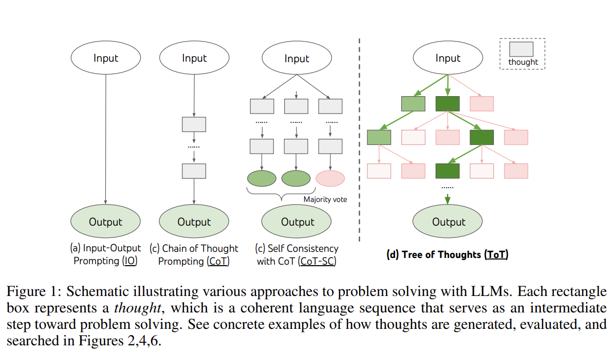
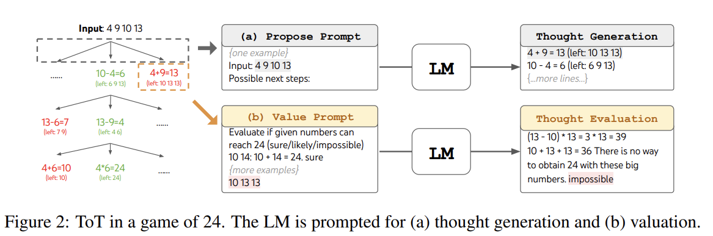

# Tree of Thoughts

## TOT概述

对于需要探索或预判战略的复杂任务来说，传统或简单的提示技巧是不够的。TOT通过构建并维护一颗思维树，引导语言模型将思维作为中间步骤来解决复杂问题。

LLM的自回归机制，从左到右逐个生成token并作出决策，这种简单的策略，似乎不能够让LLM成为通用的问题求解器。

人类在决策的时候有两种模式——快速、自动、无意识的"直觉"和缓慢、深思熟虑、有意识的"分析"。解决问题可以看作是在问题空间中搜索解空间的过程，将问题空间用树表示，每个节点代表解决问题的中间想法。有助于让LLM进行自我评估，并展示思维过程。

用LLM解决一般问题的两大不足可以用树结构来解决：

1. 没有探索思维过程中的不同延续——即树的分支
2. 没有融入任何类型的规划、探索或者预测

<figure><figcaption>
TOT
</figcaption></figure>

## TOT实例

以算24点的游戏任务为例：

<figure><figcaption>
Game of 24
</figcaption></figure>

由于是4个数字做四则运算，因此可以分为3个思维步骤，每个步骤都保留最优的5个候选项。每次思维的候选项都要求LLM给出能否得到24点的评估：\
sure/maybe/possible

目的是得到经过少量向前尝试就可以验证正确（sure）的局部解，基于‘太大/太小’的常识消除那些不可能（impossible）的局部解，其余的局部解作为‘maybe’保留。

## 基于RL的TOT

https://arxiv.org/abs/2305.08291

## TOT提示法

https://github.com/dave1010/tree-of-thought-prompting

## 参考资料

1. https://www.promptingguide.ai/zh/techniques/tot
2. https://arxiv.org/abs/2305.10601
