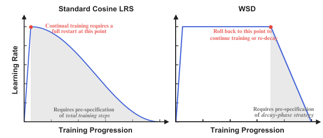

# 超参配置

### 0 快速决策表

<table data-header-hidden><thead><tr><th>超参数</th><th width="243.666748046875">大规模预训练 （多机多卡）</th><th>中等规模/单卡预训练（单机多卡/单机单卡）</th><th>LoRA微调</th></tr></thead><tbody><tr><td><strong>学习率调度</strong></td><td><strong>WSD</strong> • Warmup: 1-2% • Stable: 88-89% • Decay: 10% 步数 → 0.1×Peak Peak: 3e-4 ~ 1e-4（随模型参数增大降低）</td><td><strong>WSD</strong> 比例同上，但可延长 Warmup 至 5% Peak: 1e-4 ~ 5e-5</td><td><strong>WSD</strong> • Warmup: 10% 步数 • Stable: 80% • Decay: 10% <strong>Peak: 2e-4</strong></td></tr><tr><td><strong>Batch Size</strong></td><td><strong>最小可行</strong> Global Batch: 4M-8M tokens （约 16-32 样本 × 序列长度 × GPU数） 不使用梯度累积</td><td><strong>最小可行</strong> 大约 1-16 不使用梯度累积</td><td><strong>16-32</strong> 可通过梯度累积实现</td></tr><tr><td><strong>优化器</strong></td><td><strong>AdamW /</strong> <strong>Muon</strong>（实验性，省50%显存）</td><td><strong>AdamW</strong></td><td><strong>AdamW</strong></td></tr><tr><td><strong>AdamW 参数</strong></td><td>β1=0.9 <strong>β2=0.95</strong>（预训练关键） ε=1e-5（LLM稳定值） Weight Decay: <strong>0.01</strong> (GPT) / <strong>0.1</strong> (LLaMA)</td><td>β1=0.9 β2=0.99~0.999（按 half-life 缩放） ε=1e-5 Weight Decay: 0.01-0.1</td><td>β1=0.9 β2=0.999 ε=1e-6 Weight Decay: <strong>0.01</strong>（通常更低）</td></tr><tr><td><strong>Epoch/步数</strong></td><td><strong>1 epoch</strong> （Single-pass，数据量 > 1T tokens）</td><td><strong>1-2 epochs</strong></td><td><strong>3-5 epochs</strong> + Early Stopping</td></tr><tr><td><strong>梯度裁剪</strong></td><td>1.0</td><td>1.0</td><td><strong>1.0-5.0</strong> 配合 2e-4 学习率</td></tr><tr><td>其它</td><td>• 禁用 Dropout 提升下游任务性能 • 优先用最大 batch size 而非梯度累积</td><td><ul><li>学习率需按 √B 缩放</li></ul></td><td>• rank 通常 8-64 • alpha = 2×rank • target_modules: q_proj, v_proj</td></tr></tbody></table>

### 1 学习率调度

当前 LLM 预训练的首选 **Warmup-Stable-Decay (WSD)**

分为三个阶段：

* **Warmup**：线性预热（通常占总步数的1-2%），从0升至峰值学习率（如 $$6\times10^{-4}$$）
* **Stable**：长时间保持恒定学习率
* **Decay**：在选定checkpoint后，使用快速衰减（如线性或余弦衰减至峰值的10%）

**核心优势**：

1. **连续训练友好**：无需预先确定总步数，可从stable阶段的任意checkpoint分支进行decay实验
2. **loss动态独特**：stable阶段loss下降缓慢（高于Cosine schedule），但decay阶段会出现**sharp drop**（DeepSeek、OLMo、MiniMax 等训练日志中均有记录），最终性能往往优于Cosine

<figure><figcaption></figcaption></figure>

#### **Cosine Decay with Restarts vs. Linear Decay**

* **Cosine Annealing**：需要预先确定总训练步数，学习率平滑下降。虽然稳定，但缺乏灵活性，无法轻松扩展训练
* **Linear Decay**：简单直接，但可能导致后期学习率下降过快，不如Cosine平滑

***

### 2. 如何设置 Batch Size

&#x20;Batch Size&#x20;

苏剑林在《当 Batch Size 增大时，学习率该如何随之变化？》 中系统梳理了几种主流视角：

#### 一、方差视角（平方根缩放）s

最早的理论认为，batch size 扩大到 $$n$$ 倍时，学习率应扩大到 $$\sqrt{n}$$ 倍。推导基于**保持 SGD 增量的方差不变**：

* Batch size 增大 → 梯度协方差矩阵缩小为 $$1/B$$ → 为保持噪声强度，学习率需满足 $$\eta^2/B = \text{常数}$$ → $$\eta \propto \sqrt{B}$$

#### 二、直面损失视角（单调有界缩放）

OpenAI《An Empirical Model of Large-Batch Training》提出更本质的二阶近似分析：

* 最优学习率$$\eta^* \approx \frac{\eta_{max}}{1 + \mathcal{B}_{\text{noise}}/B}$$
* **关键结论**：学习率随 batch size 增加而**单调递增但有上界** $$\eta_{max}$$
* 当 $$B \ll \mathcal{B}_{\text{noise}}$$（小 batch）：近似**线性缩放** $$\eta \propto B$$
* 当 $$B \gg \mathcal{B}_{\text{noise}}$$（大 batch）：学习率趋于饱和，**不应继续增大**

其中 $$\mathcal{B}_{\text{noise}} = \frac{\text{tr}(\Sigma)}{g^\top g}$$ 是**信噪比倒数**，反映梯度噪声强度与信号强度的比值。

#### 工业界常规

前沿 LLM（GPT、Llama 等）通常在**大规模集群**上使用极大的 batch size（数百万 token），因为：

* 梯度估计更稳定，可使用更大学习率加速收敛
* 最大化 GPU 吞吐量（throughput），提高训练效率
* 配合 Adam/AdamW 等复杂优化器

通常会使用**硬件能支持的最大 batch size**

#### 梯度累积的陷阱

当显存不足时，常见做法是通过梯度累积（Gradient Accumulation）模拟大 batch。但需要注意：

* **Google Research 明确指出**：梯度累积不会提供吞吐量收益，只是内存受限时的 workaround
* 它通过"以时间换空间"增加训练 wall-clock 时间，且可能使超参调优复杂化

#### 小 Batch Size 的新范式（2024-2025 研究进展）

最新的研究颠覆了大 batch 的"政治正确"，发现：

* **小 batch size（甚至到 1）** 在 LLM 预训练中不仅稳定，而且**更鲁棒**（对超参不敏感）
* 配合适当的超参数缩放（如调整 Adam 的 $\beta\_2$ 保持 half-life 一致），小 batch 可达到与大 batch **相当或更优的 per-FLOP 性能**
* 小 batch 使得**简单优化器**（如 vanilla SGD 无动量、Adafactor）变得可行，节省大量优化器状态内存

**关键建议**：在内存受限场景（单卡/小规模训练），**优先使用小 batch size + 简单优化器，而非梯度累积模拟大 batch**

### 3. 实用的设置指南

| 场景                  | Batch Size 策略                                   | 学习率调整                             | 优化器选择                        |
| ------------------- | ----------------------------------------------- | --------------------------------- | ---------------------------- |
| **大规模预训练**（多机多卡）    | 使用最大可行 batch size（通常 4M-8M tokens/global batch） | 按线性缩放或单调有界规则调整                    | AdamW（配合 careful tuning）     |
| **显存受限预训练**（单卡/小集群） | **最小化 batch size**（最大化 throughput 的最小值，如 1-16）  | 按 $\sqrt{B}$ 或特殊缩放规则调整 $\beta\_2$ | Adafactor 或 Vanilla SGD（无动量） |
| **微调（Fine-tuning）** | 16-32（LoRA）；1-4（全参数微调显存受限时）                     | 较小学习率（如 1e-4）                     | AdamW（LoRA）或 Adafactor（全参数）  |

#### 具体操作建议

1. **确定最大可行 batch size**：通过 `auto_find_batch_size` 或逐步增加直到 OOM
2. **学习率同步调整**：
   * 如果 batch size 从 $B\_0$ 改为 $B\_1$，按以下规则调整学习率：
     * **线性**：$\eta\_{new} = \eta\_{old} \times (B\_1/B\_0)$（适用于小 batch 区间 $B \ll \mathcal{B}\_{\text{noise\}}$）
     * **平方根**：$\eta\_{new} = \eta\_{old} \times \sqrt{B\_1/B\_0}$（适用于方差主导场景）
     * **单调有界**：$\eta\_{new} = \eta\_{max} / (1 + \mathcal{B}_{\text{noise\}}/B_{new})$（最严谨，需估计 $\mathcal{B}\_{\text{noise\}}$）
3. **Adam 超参的隐式缩放**：
   * 当改变 batch size 时，不仅要调学习率，还应调整 $\beta\_2$ 以保持**二阶矩的 half-life** 一致
   * 公式：$(\beta\_2^{(new)})^{B\_{new\}} = (\beta\_2^{(old)})^{B\_{old\}}$
   * 例如：batch size 从 512（$\beta\_2=0.95$）降到 1，则 $\beta\_2^{(1)} = 0.95^{512} \approx 0.9999$
4. **避免梯度累积**：
   * 除非在多设备多模型副本且受限于设备间带宽，否则**不建议使用梯度累积**
   * 如果必须使用，记住它只是内存 workaround，不会加速训练

### 4. 总结

苏剑林的核心理论揭示了 batch size 与学习率之间**非线性、有上界**的本质关系，而非简单的线性或平方根规则。在 LLM 预训练中：

* **资源充裕时**：遵循"越大越好"，用最大 batch size 配合线性/有界缩放
* **资源受限时**：拥抱小 batch size（1-16），配合简单优化器（SGD/Adafactor）和超参缩放，**放弃梯度累积**

关键是理解**batch size 影响的是信噪比和优化器更新频率**，而 LLM 训练通常处于"远未收敛"的 regime，因此小 batch 的高频率更新反而可能更高效。

#### **渐增大Batch策略（Seesaw方法）**

**原理**：在训练过程中逐步增大batch size而非减小学习率。理论证明，在SGD中：**将batch size翻倍等价于将学习率减半**。

对于Adam类优化器，**Seesaw** 调度策略 ：

* 当标准调度会将学习率减半时，改为：
  * Batch size × 2
  * Learning rate × $1/\sqrt{2}$（而非1/2）

**效果**：在Chinchilla配置下，可减少约**36%的串行训练时间**（wall-clock time），同时保持与Cosine decay相同的loss轨迹。

**关键考虑**：

* 需在\*\*临界batch size（critical batch size）\*\*以下操作
* 需配合梯度裁剪（max\_grad\_norm）使用，防止大batch导致的不稳定

***

### 3. 优化器细节

#### **AdamW（当前标准配置）**

**推荐参数设置**：

* **β1（一阶矩衰减）**：0.9
* **β2（二阶矩衰减）**：0.95（预训练）或 0.999（微调）。**0.95在预训练中表现更好**
* **ε（数值稳定性）**：$1\times10^{-5}$ 到 $1\times10^{-8}$。较大的ε（如1e-5）在LLM训练中更稳定
* **权重衰减**：0.01（GPT架构）到 0.1（LLaMA/T5架构）

**原理**：解耦权重衰减与L2正则化，避免Adam中自适应梯度导致的权重衰减效果衰减问题。

#### **Muon**

#### **Adafactor（内存受限场景）**

**优势**：

* **内存效率**：通过因子分解二阶动量矩阵（$v \approx R \times C$），将显存占用从Adam的**12 bytes/参数**降至**4-8 bytes/参数**
* 适合千亿参数模型或单卡训练（如24GB显存训练13B模型）

**代价**：

* 需要更精细的超参调优（学习率通常需比Adam大2-10倍）
* 收敛速度略慢，下游任务性能可能略低于AdamW

#### **新型优化器对比**

| 优化器        | 显存占用      | 收敛速度   | 下游性能   | 适用场景                |
| ---------- | --------- | ------ | ------ | ------------------- |
| **AdamW**  | 高（12B/参数） | 快      | **最佳** | 通用预训练、追求下游性能        |
| **Lion**   | 中（8B/参数）  | **最快** | 中等     | 快速迭代、资源受限预训练        |
| **Sophia** | 中-高       | 中等     | 较好     | 多epoch训练、验证loss敏感场景 |

**Sophia**（二阶优化器）特点：

* 使用Hessian对角线估计进行自适应预处理
* 在多epoch regime下验证loss最低，但下游任务准确率通常不如AdamW
* 计算开销比Adam高约6%

基于你提供的配置清单和最新研究，我来深入解析这四种优化器的**核心机制**、**数学本质**和**适用场景**：

### 1. AdamW（Adaptive Moment Estimation with Weight Decay）

**核心创新：解耦权重衰减（Decoupled Weight Decay）**

与 Adam 的 L2 正则化有本质区别：

* **Adam 的 L2**：梯度更新为 $\theta \leftarrow \theta - \eta(\frac{\hat{m\}}{\sqrt{\hat{v\}}+\epsilon} + \lambda\theta)$，其中自适应项 $\frac{1}{\sqrt{\hat{v\}}}$ 会**削弱**权重衰减效果（梯度大的参数权重衰减小）
* **AdamW**：直接将权重衰减应用于参数更新步骤 $\theta \leftarrow \theta - \eta\frac{\hat{m\}}{\sqrt{\hat{v\}}+\epsilon} - \eta\lambda\theta$，**不受梯度尺度影响**，所有参数以相同速率 $\lambda$ 衰减

**参数设置原理**：

* **β2=0.95（预训练）**：较小的二阶矩衰减率意味着更快的"遗忘"速度，使优化器对数据分布的非平稳性（预训练数据在不同阶段有不同特征）更敏感，适应更快
* **β2=0.999（微调）**：微调时数据分布稳定，需要长期累积二阶统计信息以获得更平滑的梯度估计
* **ε=1e-5（LLM 稳定）**：较大的 epsilon 防止除以极小值，在梯度稀疏的大模型中避免数值爆炸

### 2. Muon（Matrix Orthogonalization Optimizer）

**核心机制：梯度正交归一化**

由 Keller Jordan 提出（2024），针对**矩阵参数**（如线性层权重 $W \in \mathbb{R}^{m \times n}$）设计：

1. 对梯度矩阵 $G$ 进行 SVD 分解：$G = U \Sigma V^T$
2. **正交化梯度**：$G\_{orth} = U V^T$（丢弃奇异值 $\Sigma$，仅保留旋转分量）
3. 更新规则：$W \leftarrow W - \eta \cdot G\_{orth} + \text{AdamW-style 权重衰减}$

**为什么有效**：

* 正交矩阵的谱范数为 1，防止更新步长过大导致的训练不稳定
* 强制梯度在正交流形上更新，保持参数矩阵的良好条件数，改善梯度传播
* **内存效率**：不需要存储二阶矩（无 $v$ 统计量），仅需存储梯度本身，比 AdamW 节省约 50% 优化器状态内存

**适用场景**：适合**大规模预训练**作为 AdamW 的替代，在 Cerebras 和部分开源 LLM 训练中表现出色。

### 3. Adafactor（Factorized Adaptive Learning Rates）

**核心创新：二阶矩的低秩分解（Factorized Second Moments）**

来自 Google Brain (2018)，解决 Adam 的**内存瓶颈**（Adam 需存储一阶矩 $m$ 和二阶矩 $v$，共 $2\times$ 参数量的显存）：

* **分解假设**：假设二阶矩矩阵 $V \in \mathbb{R}^{m \times n}$ 可近似为外积 $V \approx r \cdot c^T$，其中 $r \in \mathbb{R}^m$（行均值），$c \in \mathbb{R}^n$（列均值）
* **内存节省**：将存储从 $O(m \times n)$ 降至 $O(m + n)$，**每参数仅需 4-8 bytes**（vs Adam 的 12+ bytes）
* **去除了学习率调度**：通过 RMS（均方根）比例自适应调整更新步长，理论上无需外部学习率 decay（但实际中仍需配合 WSD 等调度）

**代价**：

* **超参敏感**：需要比 AdamW **大 2-10 倍的学习率**才能匹配收敛速度
* **收敛性**：在某些下游任务上性能略低于 AdamW，因为低秩分解丢失了部分二阶统计信息

**适用场景**：**千亿参数模型**或**单卡大模型训练**（如 24GB 显存训练 13B 模型）的首选。

### 4. Sophia（Second-order Clipped Optimizer）

**核心机制：Hessian 对角线估计与裁剪**

2023 年提出的**二阶优化器**，试图结合二阶信息和计算效率：

1. **Hessian 估计**：每 $k$ 步（如每 10 步）估计 Hessian 对角线 $h = \text{diag}(H)$，使用 Hutchinson 随机估计法（仅需 Hessian-向量乘积，无需完整矩阵）
2. **自适应裁剪**：更新规则为 $\theta \leftarrow \theta - \eta \cdot \text{clip}(\frac{m}{h}, \rho)$，其中 $\rho$ 是裁剪阈值（如 0.01）
3. **保护机制**：当 Hessian 曲率过大（$h$ 很大）时，裁剪防止优化器跳入"坏"的尖锐极小值

**性能特征**：

* **验证 Loss 最优**：在多 epoch regime 下，Sophia 能达到比 AdamW 更低的验证 loss
* **下游任务悖论**：尽管 loss 更低，但下游任务准确率往往不如 AdamW，可能是因为二阶裁剪导致的隐式正则化过强
* **计算开销**：比 AdamW 高约 6%（主要来自 Hessian 估计步骤）

### 选择决策树

| 优化器           | 内存占用       | 计算开销      | 推荐场景                    | 关键权衡                               |
| ------------- | ---------- | --------- | ----------------------- | ---------------------------------- |
| **AdamW**     | 高（12B/参数）  | 基准        | 通用首选，特别是有充足显存时          | 最稳定，但内存压力大                         |
| **Muon**      | 中（\~6B/参数） | 低（+SVD开销） | 大规模矩阵参数训练               | 需要实现 SVD，可能对非矩阵参数（如 Embedding）效果一般 |
| **Adafactor** | 低（4-8B/参数） | 低         | 显存受限（单卡/长序列）            | 需精细调参，收敛稍慢                         |
| **Sophia**    | 高（类似Adam）  | 高（+6%）    | 多 epoch 训练、验证 loss 敏感场景 | 下游性能不一定提升                          |

**实战建议**：

* **默认选择 AdamW**（β2=0.95），这是当前 LLM 预训练的事实标准
* **显存不足 40GB** 时切换到 **Adafactor**，并准备投入时间调参（学习率×5-10 起步）
* **追求极致吞吐量** 时考虑 **Muon**（省去二阶矩存储，通信量小）
* **Sophia** 目前仍属实验性，除非明确需要多 epoch 下的低验证 loss，否则不建议作为默认选择

***

### 4. 权重衰减与正则化

#### **Dropout在现代预训练中的地位**

**当前共识**：**在单轮（single-epoch）LLM预训练中不使用Dropout（p=0.0）**

**原理**：

* 大规模语料上的单轮预训练很少产生过拟合
* Dropout引入的噪声会阻碍收敛速度
* 不使用Dropout的模型在下游任务（BLiMP、SQuAD、MNLI）上表现更好
* 模型可编辑性（model editability）也得到改善

**例外情况**：

* **多epoch训练**或**小数据集**：可考虑使用p=0.1-0.3的dropout
* **并行层训练（Parallel Blocks）**：某些架构在特定层使用dropout以改善泛化

#### **权重衰减（Weight Decay）**

* **推荐值**：0.01-0.1（AdamW中）
* **μP（Maximal Update Parametrization）**：使用μP时，学习率和权重 decay 需按宽度进行缩放，可实现超参数从小模型向大模型的零样本迁移

这是关于 **LLM 预训练中防止过拟合的两大正则化手段**（Dropout 和 Weight Decay）的**现代实践指南**，以及一项重要的**超参数缩放理论**（μP）。

***

### 1. Dropout：为什么在现代预训练中"消失"了？

**传统认知 vs. 现代实践**

* **传统观点**：Dropout 是防止过拟合的标准手段（p=0.1-0.5）
* **LLM 共识**：当前**单轮（single-epoch）预训练不使用 Dropout**（p=0.0）

**三大原因**：

**① 单轮训练不会过拟合**

* LLM 预训练使用**海量数据**（trillions of tokens），模型只过一遍数据
* 与 CV 的多 epoch 训练不同，**没有重复暴露导致的记忆过拟合**
* 模型始终处于"欠拟合"状态，需要更多容量而非限制

**② Dropout 噪声阻碍收敛**

* Dropout 随机屏蔽神经元，引入**前向传播噪声**
* 在需要稳定梯度的大模型训练中，这种噪声会**减缓收敛速度**
* 损失曲线更难平稳下降

**③ 下游性能反而更好**

* 研究（如 OLMo、Pythia 等）表明：**无 Dropout 的模型在 BLiMP（语法）、SQuAD（QA）、MNLI（推理）上表现更优**
* 模型保持**更好的可编辑性**（model editability）——更容易通过后续微调修正知识

**例外情况**：

* **多 epoch 训练**（如领域微调、小数据集训练）：需加 Dropout（p=0.1-0.3）
* **并行层架构**（如 Parallel Transformer Blocks）：特定层使用 Dropout 改善泛化

***

### 2. 权重衰减（Weight Decay）：唯一必要的正则化

**推荐值**：**0.01（GPT 架构）到 0.1（LLaMA/T5 架构）**

#### 为什么用 Weight Decay 而非 L2 正则化？

这是 **AdamW 的核心创新**：

* **L2 正则化（传统 Adam）**：权重衰减强度与梯度成反比
  * 梯度大的参数（更新频繁）几乎不衰减
  * 梯度小的参数（稀疏特征）被过度衰减
  * **结果**：破坏稀疏特征的表达能力
* **Weight Decay（AdamW）**：**解耦**的 L2 惩罚，直接作用于参数更新步骤
  * 所有参数以**恒定速率** $\lambda$ 向零点收缩
  * **效果**：等同于对参数进行 Gaussian 先验约束，保持权重的**小范数特性**
  * 防止权重爆炸，改善泛化

#### 数值选择的考量

* **0.01**：较温和，适合深层网络（如 GPT-3 的 96 层）
* **0.1**：更强约束，LLaMA/T5 使用，配合 RMSNorm/LayerNorm 更稳定

***

### 3. μP（Maximal Update Parametrization）：超参数的"零样本迁移"

**这是最关键但易被忽视的概念**。

#### 问题背景

* 大模型（70B/400B）训练前，需要在小模型（7B/1B）上调参寻找最优学习率、权重衰减
* 但**直接线性缩放超参数到大模型往往失效**（性能崩溃或收敛极慢）
* **μP 解决了这个问题**：实现超参数从小模型到大模型的**零样本迁移（Zero-shot Transfer）**

#### 核心机制：参数化对称性

μP 基于**无限宽度极限下的训练动态稳定性**，规定了三类参数的缩放规则：

| 参数类型                    | 缩放规则                                | 目的             |
| ----------------------- | ----------------------------------- | -------------- |
| **输入嵌入** $W\_{emb}$     | $\mathcal{O}(1)$（不随宽度缩放）            | 保持前向传播信号强度     |
| **输出头/读取层**             | $\mathcal{O}(1)$                    | 保持 logits 尺度稳定 |
| **隐藏层权重** $W\_{hidden}$ | $\mathcal{O}(1/\sqrt{d\_{model\}})$ | 控制激活方差         |
| **学习率 $\eta$**          | 保持恒定（不随宽度缩放）                        | 确保更新步长一致       |
| **权重衰减 $\lambda$**      | 保持恒定                                | 保持正则化强度一致      |

**关键洞察**：在 μP 下，**小模型的最优超参数 = 大模型的最优超参数**

#### 实际意义

* **在小模型（如 1B）上 Grid Search** 找到最佳学习率（如 3e-4）和权重衰减（如 0.1）
* **直接应用于 70B 模型**，无需重新调参即可获得接近最优性能
* **Tensor Programs 理论**保证了这种宽度的独立性

#### 与标准参数化（Standard Parametrization, SP）的区别

* **SP**：隐藏层权重 $W \sim \mathcal{N}(0, 1/d\_{in})$，需要随宽度调整学习率（通常 $\eta \propto 1/\sqrt{d\_{model\}}$）
* **μP**：隐藏层权重 $W \sim \mathcal{N}(0, 1/d\_{model})$，学习率**宽度无关**

***

### 总结：正则化的现代配方

| 组件               | 单轮预训练                    | 微调/多轮训练         |
| ---------------- | ------------------------ | --------------- |
| **Dropout**      | ❌ **禁用**（p=0.0）          | ✅ 启用（p=0.1-0.3） |
| **Weight Decay** | ✅ **必须**（0.01-0.1，AdamW） | ✅ 保持（可略降）       |
| **μP 参数化**       | ✅ **强烈推荐**（实现超参数迁移）      | 可选              |

**核心逻辑**：

* 单轮预训练：**数据噪声 > 模型容量**，无需 Dropout，只需 Weight Decay 控制权重范数
* μP：**用理论保证替代昂贵的超参数搜索**，是小成本实验通往大模型训练的桥梁

### 超参搜索

<figure><figcaption></figcaption></figure>

以下是该文档的中文翻译，保持了原文的结构和技术准确性，同时确保语言流畅自然：

***

**微调大语言模型：超参数最佳实践**

**大语言模型微调的超参数实用规则：学习率预热-稳定-衰减策略、批量大小与梯度策略、训练轮数，以及自动化调优工作流程。**

César Miguelañez

2026年2月2日

微调大语言模型（LLMs）可以将通用模型转变为特定任务的专家，但成功的关键在于优化核心超参数。以下是您需要了解的内容：

* **学习率**：LoRA微调建议从2e-4开始，采用预热-稳定-衰减（warmup-stable-decay）调度策略，以平衡训练速度和稳定性。
* **批量大小**：使用GPU能承载的最大批量大小（建议16或32）。梯度累积是解决内存限制的权宜之计，但不会加速训练。
* **训练轮数**：通常3-5个轮次（epochs）就足够了。使用早停（early stopping）防止过拟合，节省计算资源。

过拟合、灾难性遗忘和资源限制等挑战，使得结构化工作流程变得至关重要。建议先用较小的模型和数据集快速测试配置，然后再扩大规模。贝叶斯优化（Bayesian optimization）或基于种群的训练（Population-Based Training, PBT）等自动化方法可以简化复杂场景下的超参数调优。

关键在于平衡效率与准确性——聚焦高质量数据、监控指标，并迭代优化设置以实现最佳性能。

### 需要优化的关键超参数

微调模型时，有三个超参数最具影响力：学习率、批量大小和训练轮数。这些参数直接影响模型学习的速度、训练过程的稳定性，以及模型对新数据的泛化能力。设置不当会浪费资源；设置得当则能让模型具备部署条件。

#### 学习率与调度策略

学习率控制模型权重在每次训练步骤中的调整幅度。可以将其视为模型寻找最优解决方案时的步长。高学习率能加快训练，但存在跳过最优解或导致过程不稳定的风险。另一方面，低学习率确保稳定，但可能减慢进度或使模型陷入次优解。

动态调度通过三个阶段管理学习率：**预热（warmup）、稳定（stable）和衰减（decay）**。预热阶段以较小的学习率开始，避免早期更新不稳定。稳定阶段保持较高学习率以实现高效学习。最后，衰减阶段逐渐降低学习率，让模型找到更好的解决方案。对于LoRA微调，建议从2e-4的学习率开始，采用预热-稳定-衰减调度，在整个训练过程的80%保持高学习率，然后骤降至原来的10%。正如Modal解决方案工程师Yiren Lu所说：

> "学习率越大，微调速度越快，但你必须在速度与跳过最优解或导致训练不稳定的风险之间取得平衡。"

密切关注训练损失。如果出现突然的峰值或"NaN"（非数字）值，这是危险信号——立即降低学习率。一个经验法则是将预热步数设置为总训练步数的10%。

接下来，让我们看看批量大小如何进一步影响训练效率和稳定性。

#### 批量大小与梯度累积

批量大小决定了在更新模型权重前处理多少个训练样本。较大的批量提供更稳定的梯度估计，但需要更多GPU内存。为了最大化效率，尽量使用GPU能承载的最大批量大小。

如果内存限制影响了批量大小，梯度累积可以提供帮助。该技术处理多个较小的批次，累积它们的梯度后再更新模型权重。对于LoRA微调，有效的批量大小通常为16或32。

然而，梯度累积有其局限性。**它不会提高训练速度**；相反，它只是解决内存问题的变通方案。正如谷歌研究所指出的：

> "梯度累积模拟了硬件无法支持的更大批量大小，因此不会提供任何吞吐量优势。在应用工作中通常应避免使用。"

仅当批量大小极小（如1或2）时才使用梯度累积以维持训练稳定性。如果您的GPU能处理16或更大的批量大小，梯度累积不会带来额外好处，反而可能使超参数调优复杂化。此外，请记住调整批量大小通常需要重新调整学习率，因为两者密切相关。Hugging Face的`auto_find_batch_size`等工具可以帮助识别硬件支持的最大可行批量大小。

现在，让我们探讨最后一个关键要素：如何确定合适的训练轮数。

#### 训练轮数与早停

一个轮次（epoch）是对整个训练数据集的一次完整遍历。挑战在于找到欠拟合（学习不足）和过拟合（记忆训练数据而非理解更广泛模式）之间的平衡。

对于大多数微调任务，**3-5个轮次**就足够了。密切监控验证损失，并使用早停来避免过拟合和节省计算资源。正如Lakera AI的Armin Norouzi所解释的：

> "实施早停机制对于防止过拟合至关重要。如果模型在验证集上的性能趋于平稳或下降，可以停止训练以避免进一步的过拟合。"

早停与检查点（checkpointing）配合良好，后者在过拟合开始前保存模型的最佳状态。这对于较小的数据集尤为重要，因为它们更容易过拟合。

### 微调优化技术

_LLM微调超参数优化方法对比（表格保留原结构）_

确定了关键超参数后，下一个挑战是如何有效地微调它们。自动化优化方法可以通过系统地探索不同配置来简化这一过程。

#### 网格搜索与随机搜索

如果您刚开始，在深入更复杂的技术之前，值得先尝试网格搜索或随机搜索等简单方法。

网格搜索涉及测试超参数的每一种可能组合。虽然这能保证对搜索空间进行全面探索，但缺点是计算成本高昂。添加的参数越多，成本就呈指数级增长——这使得网格搜索对于拥有数十亿参数的大型模型（如LLM）不太实用。

相比之下，随机搜索从预定义的分布中随机采样超参数值。这种方法可能出奇地有效，因为只有少数超参数对性能有重大影响。此外，由于每次试验都是独立的，您可以并行运行多个实验。对于高维空间，这使得随机搜索成为一个实用且高效的起点。

#### 贝叶斯优化

贝叶斯优化采用更智能的方法，将超参数调优视为一个需要学习的问题。它使用概率模型（通常是高斯过程）基于先前结果预测哪些超参数组合可能表现良好。这种方法在探索新可能性和聚焦有前景的配置之间取得平衡。

这对于昂贵的训练设置特别有用。例如，2024年1月，蒙特利尔理工学院和华为加拿大研究院的研究人员使用LoRA在67,000条指令上微调了LLaMA 2 7B模型。他们使用NNI中的TPE算法进行贝叶斯优化，在四块NVIDIA A100 80GB GPU上完成了100次评估。结果？优化后的模型平均MMLU得分为46.24，较基线得分43.56有显著提升——整个过程在不到五天内完成。由于贝叶斯优化通常比随机搜索需要更少的试验，它是大型模型的绝佳选择，因为训练运行资源密集。

#### 基于种群的训练（PBT）

如果您拥有丰富的计算资源，基于种群的训练（PBT）提供了一个引人注目的替代方案。与贝叶斯方法专注于减少评估次数不同，PBT强调通过利用并行性来最小化挂钟时间（wall-clock time）。

在PBT中，多个模型同时训练，形成一个"种群"。定期用较弱的模型替换较弱的模型，并动态调整超参数以保持多样性。这种在训练期间的持续适应——而非在开始时固定超参数——可以通过利用部分训练好的模型节省大量时间。

主要权衡是什么？PBT需要大量的并行计算能力。它最适用于将总训练时间作为优先事项且拥有充足GPU预算的项目。

_方法对比表格（保留原结构）：_

| 方法    | 效率 | 最佳使用场景       | 并行化程度 |
| ----- | -- | ------------ | ----- |
| 网格搜索  | 低  | 小搜索空间，需要可重复性 | 高     |
| 随机搜索  | 中  | 高维空间，简单设置    | 非常高   |
| 贝叶斯优化 | 高  | 试验预算有限的昂贵模型  | 低     |
| PBT   | 高  | 挂钟时间关键的大型集群  | 中     |

### 超参数工作流程最佳实践

结构化工作流程是有效超参数调优的支柱。它们确保每次训练迭代都能推动模型性能提升，同时平衡速度、成本和准确性。平庸结果与专家级结果之间的差异往往在于方法。

#### 从小模型和数据集开始

先用较小的模型和数据集子集开始实验。例如，不要直接进入700亿参数的模型，而应从80亿参数的模型开始。这种策略大幅缩短实验时间，让您可以在不耗尽计算预算的情况下测试各种超参数配置。

> "选择快速且最小化资源使用的初始配置，将使超参数调优更加高效。" —— 谷歌研究，《调优手册》

研究表明，使用Llama-3-8B或Mistral-7B等较小模型进行实验可以获得宝贵的见解。一旦确定了在小规模上表现良好的超参数设置，您就可以 confidently 扩展到完整模型和数据集。这种循序渐进的方法也有助于及早发现过拟合等问题，此时解决成本更低。事实上，从仅50个高质量训练样本开始，就足以评估模型是否达到准确性目标，然后再投入更大的数据集。

一旦在这些小型实验中确定了稳定设置，重点就转向监控指标以进一步优化。

#### 监控指标并防止过拟合

密切关注训练损失和验证损失之间的差距，对于发现过拟合至关重要。如果训练损失持续下降而验证损失开始上升，这清楚地表明您的模型正在记忆训练数据，而非学习可泛化的模式。定期跟踪指标，并在验证性能停止改善或开始下降时使用早停。

除了损失，还要监控任务特定指标，如准确率、F1分数或BLEU分数，以确保模型在功能环境中表现良好。频繁保存检查点，以捕获性能最佳的模型状态，而非仅依赖最终轮次的输出。这对于大型语言模型（LLM）尤为重要，它们容易过拟合，特别是在特定领域的小数据集上微调时。

有了早停机制，您可以通过引入梯度裁剪进一步稳定训练。

#### 使用梯度裁剪

梯度裁剪对于保持训练稳定至关重要，特别是在处理大型模型或尝试较高学习率时。没有它，您将面临梯度爆炸的风险，即权重更新变得过大，导致训练过程失控。

> "注意验证指标与训练指标的差异……如果损失出现峰值或变为NaN，请降低学习率。" —— Predibase

这种技术在推动学习率以加速收敛时特别有用。通过限制梯度，您可以尝试激进的超参数而不 destabilizing 训练。对于LoRA微调，将梯度裁剪与约2e-4的起始学习率结合，提供了一个坚实的基线，可以根据训练进展进行调整。

### 使用Latitude进行超参数微调

超参数调优的核心在于创建一个工作流程，收集见解、整合反馈并带来更好的性能。Latitude的开源平台简化了这一过程，帮助团队观察模型行为并根据真实数据调整配置。

通过构建前述策略，Latitude让整个调优过程更加高效。

#### 可观测性与评估追踪

为了做出明智决策并确保可重复性，追踪超参数实验至关重要。Latitude允许团队记录每次提示运行，包含完整上下文、输出和元数据，包括用户类型或数据源等自定义详情。

其评估追踪功能支持批量评估，能够跨多个指标比较超参数配置。在外部微调后，您可以将模型带回Latitude，将其设置为提供商，并针对基线测量结果。这种闭环方法确保每次调整都在投入生产前用真实数据进行测试。

这些观测结果无缝反馈到下一轮调优。

#### 迭代调优的反馈收集

人工反馈是有限但宝贵的资源。Latitude通过提供人在回路（human-in-the-loop）评估工具来解决这一挑战，允许领域专家审查模型响应并提供结构化反馈。这种协作设置弥合了工程师与领域专家之间的鸿沟，使他们能够共同优化提示并改进模型行为。

> "没有模型是完美的，用户交互提供了洞察其优缺点的金矿。" —— Aarti Jha

使用Latitude，您可以创建高质量、人工审查的输出数据集，作为优化超参数的真实标准（ground truth）。这些数据集可以导出为CSV文件到外部微调流程，在那里您可以测试各种超参数配置。调优完成后，将模型重新导入Latitude，并针对原始精选数据集验证其性能。版本控制和标签等功能有助于追踪变更并在需要时回滚。

这种持续的反馈循环推动模型的持续改进。

#### 持续改进流程

超参数优化不是一次性任务——而是一个持续的过程。Latitude通过支持"飞轮"方法来支持这种迭代周期：评估、收集反馈、调整超参数、测量结果。自动化日志记录捕捉每次实验，便于比较配置并识别真正有效的方法。

> "优化模型输出需要结合评估、提示工程和微调，创建一个反馈飞轮，带来更好的提示和更好的训练数据。" —— OpenAI

有了Latitude，这个周期成为一个简化的流程，确保随时间持续改进。

### 结论

超参数优化是微调大语言模型（LLM）的支柱。根据谷歌研究，即使有了进步，深度神经网络仍然需要相当的努力和试错。为了简化流程，从默认设置开始（如LoRA的2e-4学习率），并一次调整一个参数。

这为什么重要？因为使用错误的超参数可能导致模型发散或浪费宝贵的GPU时间。涉及超过10,000次微调实验的大规模研究表明，测试少量精心选择的配置通常能产生与穷举网格搜索相当的结果。换句话说，效率与准确性同样重要。

优化是一个持续的过程。像Latitude这样的工具通过提供可观测性、评估指标和反馈收集等功能简化了这一旅程。这些平台为曾经的试错过程带来了结构，将其转变为可扩展的科学方法。

聚焦高质量数据，从小实验开始，并建立一个随每次迭代改进的可重复系统。有了调优良好的超参数和结构化工作流程，您的模型就能在生产环境中保持一致的性能。

### 常见问题

**Q: LoRA微调的理想起始学习率是多少，为什么重要？** 对于LoRA微调，最好从较低的学习率开始，通常在1e-4或更低。这种方法有助于保持训练过程稳定，让模型在偏离轨道或过拟合之前适应新任务。

使用谨慎的学习率确保微调进行渐进式调整。这样，模型在适应特定任务的同时保留预训练知识。另一方面，从较高学习率开始会使过程不稳定并产生次优结果——特别是在处理大语言模型（LLM）时。

**Q: 在考虑内存限制的情况下，管理批量大小的最佳方式是什么？** 在内存限制下管理批量大小，关键在于在性能和可用资源之间找到平衡。一个好的起点是使用较小的批量大小，确保您的系统能在不遇到内存问题的情况下处理工作负载。然后，如果硬件允许，您可以慢慢增加批量大小，密切关注内存使用情况以防止崩溃或性能下降。

如果内存仍然是限制因素，您可以探索梯度累积等方法。这种技术允许您通过将工作负载分解为更小、更易管理的批次来模拟更大的批量大小。这是在硬件能力范围内提升性能的有效方式。

**Q: 早停对于防止LLM微调中的过拟合为什么重要？** 早停通过在模型开始过拟合之前（本质上是记忆训练数据之前）停止训练，在机器学习中发挥关键作用。这有助于模型保留对新的、未见数据的良好泛化能力，这对于实际场景中的可靠性能至关重要。

通过关注验证损失等指标，早停有助于 pinpoint 停止训练的理想时机。这种技术在实现有效结果和最小化训练时间之间取得平衡，同时削减不必要的计算开支。

### 参考

1. [https://arxiv.org/pdf/2507.17634](https://arxiv.org/pdf/2507.17634)
2. [https://spaces.ac.cn/archives/10542](https://spaces.ac.cn/archives/10542)
3. [https://latitude.so/blog/fine-tuning-llms-hyperparameter-best-practices](https://latitude.so/blog/fine-tuning-llms-hyperparameter-best-practices)
4. [https://arxiv.org/pdf/2507.07101](https://arxiv.org/pdf/2507.07101)
