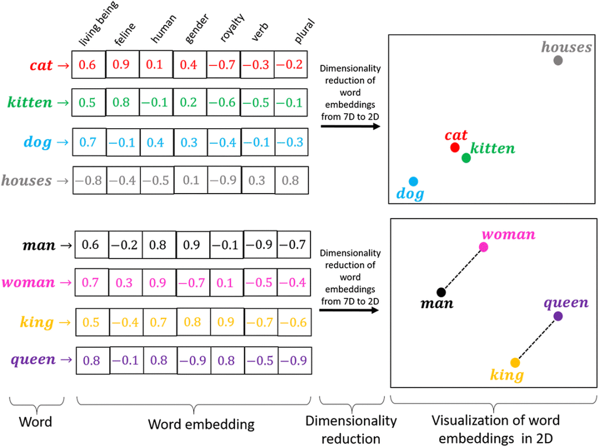

# Embedding

## 1 为什么LLM需要Embedding
西瓜有很多特征，比如大小、颜色、重量等等，这些特征可以用一个向量表示，比如`[0.1, 0.2, 0.3]`。当然，它可以有无数的特征，但是如果只选择一些关键特征作为表征就已经足够了，即用低维向量表示高维特征。

LLM的输入是一个token序列，Embedding的作用是将词汇映射到向量空间，使得语义上相似的词汇在向量空间中也相近。Embedding是表示学习的一种形式，它允许模型从数据中自动学习到有用的特征表示，而不需要人为设计特征。

因此，Embedding的目的是：
- <b>数值化表示</b>：将离散的高维数据映射到低维的连续向量空间。这个过程会生成由实数构成的向量，用于捕捉原始数据的潜在关系和结构。
- <b>捕捉语义信息</b>：在训练过程中，模型会学习将具有相似含义或上下文的单词映射到相近的向量空间位置，使得向量之间的距离或夹角能够反映单词之间的语义相似度。
- <b>提取复杂特征</b>：能够更全面地捕捉数据的复杂特征，使模型能够更好地学习并应用这些特征。

<figure><figcaption><p>Embedding</p></figcaption></figure>


文本表示的类型：

- 基于one-hot、tf-idf等的bag-of-words
- 主题模型：LSA（SVD）、pLSA、LDA
- 基于词向量的固定表征：word2vec、fastText、glove
- 基于词向量的动态表征：ELMO、GPT、bert

## 2 bag-of-words
词袋模型（Bag-of-Words model，BOW）的基本思想是：假定对于一段文本，忽略其词序和语法，仅将其当作一个词汇的集合，如同一个袋子一样。
### 2.1 从one-hot讲起
例如一句话`I love you`，每个词都是一个数值表示：
```
I: [1, 0, 0]
love: [0, 1, 0]
you: [0, 0, 1]
```
这是一种简单的编码方式，但是存在着维度灾难（词越多越稀疏）和语义鸿沟（无法进行相似度计算）等问题。

### 2.2 tf-idf
如果仅仅考虑词汇的词频（即TF），会导致一些常见词汇的权重过高，而忽略了一些重要的词汇。

TF-IDF（Term Frequency-Inverse Document Frequency）通过引入逆文档频率（IDF）来更好地体现文本特征。TF-IDF的计算公式如下：
```
TF(t) = frequency of t in document / total words in document
IDF(t) = log(total documents / number of documents with term t in it + 1)
TF-IDF(t) = TF(t) * IDF(t)
```

## 3 主题模型
主题模型是一种特殊的概率图模型，可以识别两个不同的词或者词组是否具有相同的主题。

<figure><figcaption><p>Topic Model</p></figcaption></figure>

主题模型将相似/相关的词语聚集成簇，称为主题。

### 3.1 LSA（SVD）
潜在语义分析（Latent Semantic Analysis，LSA）是一种基于奇异值分解（SVD）的主题模型，通过降维将文本数据转换为低维的语义空间。
#### 3.1.1 奇异值分解
<b>特征值和特征向量</b>
对于一个矩阵$A$，如果存在一个非零向量$x$，使得$Ax = \lambda x$，则称$\lambda$为$A$的特征值，$x$为$A$的特征向量。

<b>相似对角化</b>
对于一个矩阵$A$，如果存在一个可逆矩阵$P$，使得$P^{-1}AP = B$，其中$B$是对角矩阵，则称$A$被$P$对角化。

对角矩阵指的是除了对角线上的元素外，其他元素都为0的矩阵。
如：
$$
\begin{bmatrix}
1 & 0 & 0 \\
0 & 2 & 0 \\
0 & 0 & 3
\end{bmatrix}
$$

但是不是所有的矩阵都可以对角化，满足矩阵可对角化的充分必要条件是：n阶矩阵$A$有$n$个线性无关的特征向量。

<b>实对称矩阵</b>
实对称矩阵满足以下条件：
- 矩阵关于主对角线对称，即$a_{ij} = a_{ji}$

例如：
$$
\begin{bmatrix}
1 & 2 & 3 \\
2 & 4 & 5 \\
3 & 5 & 6
\end{bmatrix}
$$

实对称矩阵的所有特征向量彼此正交，所以任何实对称矩阵都可以被正交对角化。

将矩阵$P$正交化，形成矩阵$Q$，则$Q^TQ = I$，即$Q$是正交矩阵。
$$
A = PBP^{-1} = QBQ^T
$$

<b>奇异值分解</b>
更一般的情况，对于一个$m \times n$的矩阵$A$，存在两个正交矩阵$U$和$V$，使得：
$$
A = U S V^T
$$
其中$S$是一个$m \times n$的对角矩阵，对角线上的元素称为奇异值。

于是，SVD将矩阵$A$分解为三个矩阵的乘积，可以用于降维、特征提取等。

#### 3.1.2 LSA的原理
假设我们有m篇文档，词表大小为n。我们希望从所有文档中提取出K个主题，其中K为用户输入的超参。

1. 生成一个m×n维的文档-词项矩阵（Document-Term Matrix），矩阵元素为TF-IDF分数
    <figure><figcaption><p>LSA</p></figcaption></figure>
2. 使用SVD将上述矩阵的维度降到K维

    SVD首先将矩阵$A$分解为三个矩阵的乘积：
    <figure><figcaption><p>LSA</p></figcaption></figure>
    由于我们只需要前K个奇异值，所以只保留前K个奇异值，并相应地截断矩阵$U$和$V$，重新构造近似矩阵。

    在这里，矩阵$U_k$的每个行向量代表相应的文档。矩阵$V_k$的每个行向量代表相应的词项。向量的长度均为K。

    因此，SVD为每篇文档和每个词项都生成了向量表示，这些向量表示可以用于计算文档之间的相似度，或者词项之间的相似度。

#### 3.1.3 手撕LSA
1. 加载数据集，使用sklearn的`fetch_20newsgroups`加载新闻数据集
    ```python
    from sklearn.datasets import fetch_20newsgroups
    dataset = fetch_20newsgroups(shuffle=True, random_state=1, remove=('header','footers',quotes'))
    documents = dataset.data
    ```
2. 数据预处理，包括去除标点符号、分词、去停用词、词干提取等
    ```python
    news_df = pd.DataFrame({'document':documents})

    # removing everything except alphabets
    news_df['clean_doc'] = news_df['document'].str.replace("[^a-zA-Z#]", " ")

    # removing short words
    news_df['clean_doc'] = news_df['clean_doc'].apply(lambda x: ' '.join([w for w in x.split() if len(w)>3]))

    # make all text lowercase
    news_df['clean_doc'] = news_df['clean_doc'].apply(lambda x: x.lower())

    from nltk.corpus import stopwords
    stop_words = set(stopwords.words('english'))

    # tokenization
    tokenized_doc = news_df['clean_doc'].apply(lambda x: x.split())

    # remove stop-words
    tokenized_doc = tokenized_doc.apply(lambda x: [item for item in x if item not in stop_words])

    # de-tokenization
    detokenized_doc = []
    for i in range(len(news_df)):
        t = ' '.join(tokenized_doc[i])
        detokenized_doc.append(t)

    news_df['clean_doc'] = detokenized_doc
    ```

3. 创建文档-词项矩阵

    使用sklearn的TfidfVectorizer创建文档-词项矩阵
    ```python
    from sklearn.feature_extraction.text import TfidfVectorizer

    vectorizer = TfidfVectorizer(stop_words='english', max_features=1000, max_df=0.5, smooth_idf=True)

    X = vectorizer.fit_transform(news_df['clean_doc'])
    ```

4. 使用SVD进行降维
    ```python
    from sklearn.decomposition import TruncatedSVD

    svd_model = TruncatedSVD(n_components=20, algorithm='randomized', n_iter=100, random_state=42)

    svd_model.fit(X)

    print(len(svd_model.components_))
    ```

5. 获取主题词

    svd_model的组成部分是我们的主题词，我们可以通过`svd_model.components_`获取。

    ```python
    terms = vectorizer.get_feature_names()

    for i, comp in enumerate(svd_model.components_):
        terms_comp = zip(terms, comp)
        sorted_terms = sorted(terms_comp, key=lambda x:x[1], reverse=True)[:7]
        print("Topic "+str(i)+": ")
        for t in sorted_terms:
            print(t[0])
        print(" ")
    ```
    输出结果如下：
    ```
    Topic 0: like know people think good time thanks

    Topic 0: like know people think good time thanks

    Topic 1: thanks windows card drive mail file advance

    Topic 2: game team year games season players good

    Topic 3: drive scsi disk hard card drives problem

    Topic 4: windows file window files program using problem

    Topic 5: government chip mail space information encryption data

    Topic 6: like bike know chip sounds looks look

    …
    ```


#### 3.1.4 LSA的优缺点
- 优点
    - LSA快速且易于实施
    - 结果比简单的向量模型更好

- 缺点
    - LSA是线性模型，在具有非线性依赖性的数据集上效果不佳
    - LSA假设文本中的词项服从正态分布，可能不适用于所有问题
    - SVD是计算密集型的，当新数据出现时难以更新

### 3.2 pLSA
LSA的根本问题在于，尽管我们可以把$U_k$和$V_k$看作文档和词项的向量表示，但是这两个矩阵并没有明确的语义解释。pLSA（Probabilistic Latent Semantic Analysis）通过引入概率模型来解决这个问题。

#### 3.2.1 pLSA的原理

pLSA通过一个生成模型来为LSA提供概率意义上的解释。该模型假设，每篇文档都包括一系列可能的潜在主题。文档中的每个单词都不是凭空产生的，而是在这些潜在话题（即单词的概率分布）的指引下通过一定的概率生成的。

话题是单词的概率分布，文档是话题的概率分布，则单词是文档和话题的联合概率分布。

假设有M个单词集合$W=\{w_1, w_2, ..., w_M\}$，N个文档集合$D=\{d_1, d_2, ..., d_N\}$，K个主题集合$Z=\{z_1, z_2, ..., z_K\}$。概率分布$P(d)$表示生成文档$d$的概率，$P(w|z)$表示在主题$z$下生成单词$w$的概率，$P(z|d)$表示在文档$d$中生成主题$z$的概率。

<figure><figcaption><p>pLSA</p></figcaption></figure>

则$p(w|d)$的推导为：
$$
p(w|d) = \sum_{z} p(w, z|d) = \sum_{z} p(w|z, d) p(z|d)
$$

整个语料库中的概率生成可以用似然函数表示：
$$
L = \prod_{d \in D} \prod_{w \in d} p(w, d)^{n_{dw}}
$$
其中，$n_{dw}$表示文档$d$中单词$w$出现的次数。

推导后得：
$$
L = \prod_{d \in D} \prod_{w \in d} \sum_{z} p(d) p(w|z, d) p(z|d)^{n_{dw}}
$$

其中，$p(w|z, d)$和$p(z|d)$是模型的参数，可以通过EM算法进行估计。

#### 3.2.2 手撕pLSA

```python
import numpy as np
from sklearn.feature_extraction.text import CountVectorizer
 
 
class PLSA:
    def __init__(self, num_topics, num_iterations):
        self.num_topics = num_topics
        self.num_iterations = num_iterations
        self.vocab = None
        self.num_words = None
        self.num_documents = None
        self.word_count = None
        self.P_z_given_d = None
        self.P_w_given_z = None
        self.P_z_given_dw = None
 
    def fit(self, documents):
        vectorizer = CountVectorizer()
        count_matrix = vectorizer.fit_transform(documents)
        self.vocab = vectorizer.get_feature_names_out()
        self.num_words = len(self.vocab)
        self.num_documents = count_matrix.shape[0]
        self.word_count = count_matrix.toarray()
 
        # Initialize parameters
        self.P_z_given_d = np.random.rand(self.num_documents, self.num_topics)
        self.P_w_given_z = np.random.rand(self.num_topics, self.num_words)
        self.P_z_given_dw = np.zeros((self.num_documents, self.num_words, self.num_topics))
 
        # Run EM algorithm
        for i in range(self.num_iterations):
            print(f'Iteration {i + 1}')
 
            # E-step
            for d in range(self.num_documents):
                for w in range(self.num_words):
                    denominator = np.sum(self.P_w_given_z[:, w] * self.P_z_given_d[d])
                    for z in range(self.num_topics):
                        numerator = self.P_w_given_z[z, w] * self.P_z_given_d[d, z]
                        self.P_z_given_dw[d, w, z] = numerator / denominator
 
            # M-step
            for z in range(self.num_topics):
                for w in range(self.num_words):
                    numerator = 0
                    for d in range(self.num_documents):
                        numerator += self.word_count[d, w] * self.P_z_given_dw[d, w, z]
                    self.P_w_given_z[z, w] = numerator / np.sum(self.word_count)
 
            for d in range(self.num_documents):
                for z in range(self.num_topics):
                    numerator = 0
                    for w in range(self.num_words):
                        numerator += self.word_count[d, w] * self.P_z_given_dw[d, w, z]
                    self.P_z_given_d[d, z] = numerator / np.sum(self.word_count[d, :])
 
    def transform(self, documents):
        vectorizer = CountVectorizer(vocabulary=self.vocab)
        count_matrix = vectorizer.fit_transform(documents)
        word_count = count_matrix.toarray()
        P_z_given_d = np.zeros((count_matrix.shape[0], self.num_topics))
 
        for d in range(count_matrix.shape[0]):
            for z in range(self.num_topics):
                numerator = 0
                for w in range(self.num_words):
                    numerator += word_count[d, w] * self.P_w_given_z[z, w] * self.P_z_given_d[d, z]
                P_z_given_d[d, z] = numerator / np.sum(word_count[d, :])
 
        return P_z_given_d
```

#### 3.2.3 pLSA的优缺点
- 优点
    - pLSA是一种概率模型，可以为LSA提供概率意义上的解释
    - pLSA可以更好地捕捉文档和词项之间的关系
- 缺点
    - pLSA是一种非凸优化问题，容易陷入局部最优解
    - pLSA对于数据的噪声和稀疏性敏感
    - pLSA无法处理新数据的出现

### 3.3 LDA

LDA（Latent Dirichlet Allocation）可以看作是pLSA的贝叶斯版本，它引入了Dirichlet先验分布来解决pLSA的一些问题。

#### 3.3.1 为什么引入Dirichlet先验分布
pLSA采用的是频率派观点，将每篇文章对应的主题分布$P(z|d)$和每个主题对应的词分布$P(w|z)$看成未知常数，并可以求解出来。LDA采用的是贝叶斯学派的观点，认为待估计的参数（主题分布和词分布）不再是一个固定的常数，而是服从一定分布的随机变量。这个分布符合一定的先验概率分布（即Dirichlet分布），通过观测数据来更新这个分布的参数。

<figure><figcaption><p>LDA</p></figcaption></figure>


#### 3.3.2 LDA的原理
语料库的生成过程：
1. 从超参数$\alpha$的Dirichlet分布中抽样生成文档$d_i$的主题分布$\theta_i$
2. 对于文档$d_i$中的每个词$w_{ij}$：
    - 从文档$d_i$的主题分布$\theta_i$中抽样生成词$w_{ij}$的主题$z_{ij}$
    - 从主题$z_{ij}$的多项分布中抽样生成词$w_{ij}$

TODO：LDA理解起来比较复杂，后续再补充。

## 3 基于词向量的固定表征

### 3.1 Word2Vec
<figure><figcaption><p>Word2Vec</p></figcaption></figure>
Word2Vec通过一个简单的双层神经网络来从大量文本中学习单词之间的联系。

Word2Vec有两种模型：
- <b>Skip-gram</b>：通过一个词预测它周围的词，即输入一个词，输出多个词。
- <b>CBOW</b>：通过周围的词预测中心词，即输入多个词，输出一个词。

<figure><figcaption><p>Word2Vec</p></figcaption></figure>

#### 3.1.1 CBOW
- 原理
    - CBOW通过上下文（即周围的词）来预测当前词。对输入中的多个词向量做处理（如求和或者平均）来预测目标词。
- 实现方式
    - 输入层：上下文词的one-hot编码
    - 隐藏层：通过权重矩阵将输入转为低维的密集向量
    - 输出层：使用softmax预测目标词的概率分布
- 优缺点
    - 优点：在处理大型语料库时，CBOW模型能够平滑许多分布信息，对于较小的数据集表现较好。

##### 3.1.1.1 CBOW的实现
```python
import torch
import torch.nn as nn
import torch.optim as optim
```
首先创建CBOW训练使用的数据集。
```python
sentences = ["i like dog", "i love coffee", "i hate milk"]
# 构建词汇表
word_list = " ".join(sentences).split()
word_list = list(set(word_list))

# 创建one-hot映射
word_to_idx = {word: i for i, word in enumerate(word_list)}
idx_to_word = {i: word for i, word in enumerate(word_list)}

# 生成CBOW训练数据
def make_cbow_data(sentences, window_size=2):
    data = []
    for sentence in sentences:
        sentence = sentence.split()
        for idx, word in enumerate(sentence):
            # 将当前单词前后各window_size个单词作为周围词
            context = [sentence[i] for i in range(max(idx-window_size, 0), min(idx+window_size+1, len(sentence)))]
            target = word
            data.append((context, target))
    return data

cbow_data = make_cbow_data(sentences)
```

```python
# 定义one-hot编码函数
def make_one_hot_encoding(word, word_to_idx):
    # 创建一个与词汇表长度相同的全0向量
    encoding = torch.zeros(len(word_to_idx))
    # 将对应单词的位置设为1
    encoding[word_to_idx[word]] = 1
    return encoding
```

创建CBOW模型
```python
# 定义CBOW模型
class CBOW(nn.Module):
    def __init__(self, vocab_size, embedding_size):
        super(CBOW, self).__init__()
        # 从词汇表达小到隐藏层的线性层
        self.input_layer = nn.Linear(vocab_size, embedding_size)
        # 从隐藏层到词汇表大小的线性层
        self.output_layer = nn.Linear(embedding_size, vocab_size)
    
    def forward(self, X):
        # 生成嵌入
        embedding = self.input_layer(X)
        # 求平均：结合上下文信息
        embedding = torch.mean(embedding, dim=0)
        # 生成输出
        output = self.output_layer(embedding)
        return output

embedding_size = 2
cbow_model = CBOW(len(word_list), embedding_size)
```

```python
# 训练
learning_rate = 0.01
epochs = 10000
# 使用交叉熵损失
loss_fn = nn.CrossEntropyLoss()
# 使用随机梯度优化
optimizer = optim.SGD(cbow_model.parameters(), lr=learning_rate)

loss_values = []
for epoch in range(epochs):
    total_loss = 0
    for context, target in cbow_data:
        # 将上下文转换为one-hot编码
        context = torch.stack([make_one_hot_encoding(word, word_to_idx) for word in context])
        # 将目标转换为索引
        target = torch.tensor(word_to_idx[target])
        # 前向传播
        output = cbow_model(context)
        # 计算损失
        loss = loss_fn(output, target)
        total_loss += loss.item()
        # 反向传播
        optimizer.zero_grad()
        loss.backward()
        optimizer.step()
    loss_values.append(total_loss)
    if (epoch+1) % 100 == 0:
        print(f'Epoch {epoch+1}/{epochs}, Loss: {total_loss}')
```

损失函数的变化如下：
<figure><figcaption><p>CBOW-LOSS</p></figcaption></figure>

```python
# 获取嵌入
fig, ax = plt.subplots()
for word, idx in word_to_idx.items():
    embedding = cbow_model.input_layer(make_one_hot_encoding(word, word_to_idx)).detach().numpy()
    ax.scatter(embedding[0], embedding[1])
    ax.annotate(word, (embedding[0], embedding[1]))
plt.show()
```

结果如下：
<figure><figcaption><p>CBOW-EMBEDDING</p></figcaption></figure>

#### 3.1.2 Skip-gram
- 原理
    - Skip-gram通过当前词来预测周围的词。输入为一个中心词的词向量，预测该词周围一定窗口大小内的上下文词。
- 实现方式
    - 输入层：中心词的one-hot编码
    - 隐藏层：通过权重矩阵将输入转为低维的密集向量
    - 输出层：为上下文中的每个词分配概率
- 优缺点
    - 优点：在处理小数据集上表现更好，尤其是在捕捉稀有词上。通常能够学习到更好更细致的词向量表示。

##### 3.1.2.1 Skip-gram的实现
Skip-gram的实现与CBOW基本类似，只是输入和输出的处理方式不同，所以这里就不再赘述。

### 3.2 fastText

#### 3.2.1 分层softmax
sigmoid函数如下：
$$
\sigma(x) = \frac{1}{1+e^{-x}}
$$
sigmoid函数的输出是一个0到1之间的数，可以看作是一个概率值。

softmax函数如下：
$$
\sigma(x)_i = \frac{e^{x_i}}{\sum_{j=1}^{n} e^{x_j}}
$$

softmax函数计算的是某一项$x_i$在所有项中出现的概率，分母计算时需要用到所有项的值，因此计算复杂度为$O(n)$。

分层softmax是一种加速softmax计算的方法，它其实就是利用多个sigmoid函数进行二分类来达到多酚类的效果。分层softmax的计算复杂度为$O(log(n))$。

#### 3.2.2 fastText的原理
<figure><figcaption><p>fastText</p></figcaption></figure>

fastText模型架构和word2vec中的CBOW十分类似。不同的是：
1. CBOW的输入是目标单词的上下文，而fastText的输入是多个单词及其字符级n-gram特征。word2vec把语料库中的每个单词看作一个原子单元，而fastText把每个单词看作字符级n-gram的集合。比如，对于单词`where`，fastText会考虑`<wh>`, `<he>`, `<er>`, `<re>`等n-gram特征。
2. fastText输出的是文档对应的类别，使用分层softmax来加速训练。


### 3.3 GloVe
GloVe（Global Vectors for Word Representation）与传统的词嵌入方法相比，不仅关注单词的共现次数，还考虑了单词之间的全局统计信息。

#### 3.3.1 共现矩阵
共现矩阵是一个$V \times V$的矩阵，其中$V$是词汇表的大小。矩阵的每个元素$X_{ij}$表示单词$i$和单词$j$在上下文中共现的次数。

共现矩阵主要用于发现主题。滑动窗口的word-word共现矩阵可以挖掘语法和语义信息，例如：
```
I like deep learning
```
设置滑动窗口为2，可以得到以下共现矩阵：
|       | I | like | deep | learning |
|-------|---|------|------|----------|
| I     | 0 | 1    | 0    | 0        |
| like  | 1 | 0    | 1    | 0        |
| deep  | 0 | 1    | 0    | 1        |
| learning | 0 | 0    | 1    | 0        |

GloVe中的共现矩阵使用了加权函数，它根据两个单词在上下文中的距离来赋予共现次数不同的权重。权重即衰减系数：
$$
decay = \frac{1}{d}
$$
其中$d$是两个单词在上下文中的距离。

#### 3.3.2 词向量和共现矩阵的近似关系
GloVe的目标是学习一个词向量矩阵$W$，使得词向量之间的内积等于共现矩阵的对数值：
$$
W_i^T \tilde{W}_j + b_i + \tilde{b}_j = \log(X_{ij})
$$

其中，$W_i$和$\tilde{W}_j$分别是单词$i$和单词$j$的词向量，$b_i$和$\tilde{b}_j$是偏置项。

GloVe的损失函数为：
$$
J = \sum_{i, j=1}^{V} f(X_{ij})(W_i^T \tilde{W}_j + b_i + \tilde{b}_j - \log(X_{ij}))^2
$$

其中，$f(X_{ij})$是权重函数，用于平衡高频词和低频词的权重。我们希望：
- 高频共现的单词的权重要大于低频共现的单词，因此这个函数是非递减的
- 但是这个权重不应过大，在到达一定阈值后应该不再增加
- 如果两个单词没有在一起出现，则权重应该为0，它们不应该参与损失函数的计算

因此，一个常用的权重函数为：
$$
f(X_{ij}) = \begin{cases}
    (X_{ij}/X_{max})^\alpha & X_{ij} < X_{max} \\
    1 & X_{ij} \geq X_{max}
\end{cases}
$$

除开权重函数，loss函数的其它部分则是一个标准的均方误差。

#### 3.3.3 手撕GloVe
TODO


## 4 基于词向量的动态表征
在固定表征中，每个词都有一个固定的向量表示。但是在动态表征中，每个词的向量表示是根据上下文动态生成的。

### 4.1 ELMO


### 4.2 Bert

### 4.3 GPT


## 参考资料
1. https://developer.volcengine.com/articles/7389519179202134025
2. https://zhuanlan.zhihu.com/p/69521198
3. https://zhuanlan.zhihu.com/p/384452959
4. https://blog.csdn.net/mch2869253130/article/details/100629262
5. https://www.jiqizhixin.com/articles/2018-12-07-10
6. https://zhuanlan.zhihu.com/p/71027182
7. https://blog.csdn.net/zhong_ddbb/article/details/106317068
8. https://blog.csdn.net/daishabby2486/article/details/129837268
9. https://zhuanlan.zhihu.com/p/31470216
10. https://dl.acm.org/doi/pdf/10.5555/944919.944937
11. https://blog.csdn.net/L_goodboy/article/details/136346213
12. https://www.jiqizhixin.com/articles/2018-12-03-6
13. https://zhuanlan.zhihu.com/p/568064512
14. https://zhuanlan.zhihu.com/p/79573970
15. https://blog.csdn.net/Magical_Bubble/article/details/89160032
