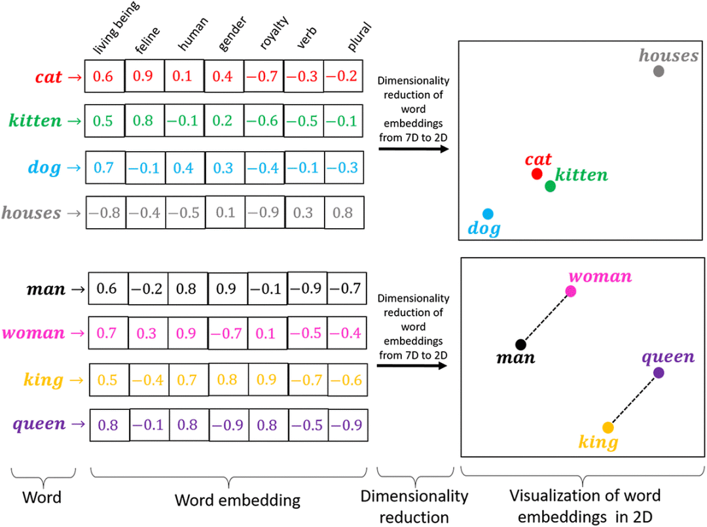

# Embeddings

## 1 为什么LLM需要Embedding

西瓜有很多特征，比如大小、颜色、重量等等，这些特征可以用一个向量表示，比如`[0.1, 0.2, 0.3]`。当然，它可以有无数的特征，但是如果只选择一些关键特征作为表征就已经足够了，即用低维向量表示高维特征。

LLM的输入是一个token序列，Embedding的作用是将词汇映射到向量空间，使得语义上相似的词汇在向量空间中也相近。Embedding是表示学习的一种形式，它允许模型从数据中自动学习到有用的特征表示，而不需要人为设计特征。

因此，Embedding的目的是：

* 数值化表示：将离散的高维数据映射到低维的连续向量空间。这个过程会生成由实数构成的向量，用于捕捉原始数据的潜在关系和结构。
* 捕捉语义信息：在训练过程中，模型会学习将具有相似含义或上下文的单词映射到相近的向量空间位置，使得向量之间的距离或夹角能够反映单词之间的语义相似度。
* 提取复杂特征：能够更全面地捕捉数据的复杂特征，使模型能够更好地学习并应用这些特征。

<figure><figcaption>
Embedding
</figcaption></figure>

## 2 Embedding分类

文本表示的类型：

* 基于one-hot、tf-idf等的bag-of-words：[bag-of-words.md](../../basics/machine-learning-basics/feature-extraction/text-representation-models/bag-of-words.md "mention")
* 主题模型：LSA（SVD）、pLSA、LDA： [topic-model.md](../../basics/machine-learning-basics/feature-extraction/text-representation-models/topic-model.md "mention")
* 基于词向量的固定表征：word2vec、fastText、glove： [static-word-embeddings.md](../../basics/machine-learning-basics/feature-extraction/text-representation-models/static-word-embeddings.md "mention")
* 基于词向量的动态表征：ELMO、GPT、bert： [elmo.md](elmo.md "mention")、 [bert.md](bert.md "mention")、 [gpt.md](gpt.md "mention")

LLM 的 Embedding 模型通常是**基于词向量的动态表征，**&#x662F;LLM模型架构本身的一部分，通常是输入层（有时也包括输出层）。在固定表征中，每个词都有一个固定的向量表示。但是在动态表征中，每个词的向量表示是根据上下文动态生成的。这种上下文感知的 embedding 能更好地捕捉词义的多样性。

## 参考资料

1. https://developer.volcengine.com/articles/7389519179202134025
2. https://zhuanlan.zhihu.com/p/69521198
3. https://zhuanlan.zhihu.com/p/384452959
