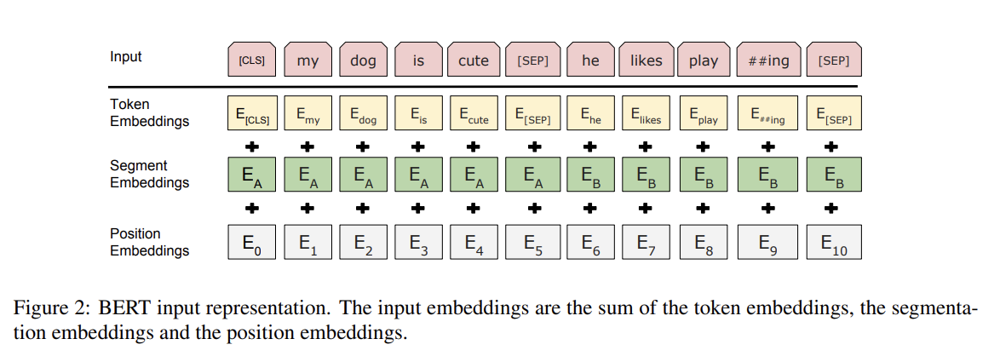

# BERT

### 1 BERT为什么叫BERT

BERT（Bidirectional Encoder Representations from Transformers）由 Google 于 2018 年推出，它的名字说明了一切：和ELMO相比，它的特征提取器是Transformer；和GPT相比，它又是双向LM建模的。

BERT的输入是一串 token 序列，该向量既可以随机初始化，也可以利用 Word2Vector等算法进行预训练以作为初始值。

输出有两种：

* 需要处理句子中的**每个单词/位置**（如找人名、判断每个词的词性） → 用 **`get_sequence_output()` →**&#x6574;个句子每一个token的向量表示，输出shape是\[batch\_size, seq\_length, hidden\_size]**→ 每个输入的token一个向量**
* 只需要给**整个句子/句子对打一个标签或分数**（如判断情感、判断两个句子是否相关） -> 用 **`get_pooled_output()` →**&#x8F93;出\[CLS]的表示，输出shape是\[batch size,hidden size]**→ 整个句子输出一个向量**

### 2 BERT的双向方法

如何才能在Transformer这个结构上做双向语言模型任务？

<figure><figcaption></figcaption></figure>

在Word2Vec的介绍中曾提到CBOW方法，就是选择一个单词，根据它的上文Context-Before和下文Context-after来预测。BERT采用了类似的方法来训练语言模型：

* 掩码语言模型 (Masked Language Model，MLM)
  * 选择语料中15%的单词
    * **80% 的概率：** 将被选中的词替换为 `[MASK]` 标志。
      * **示例：** `my dog is hairy` -> `my dog is [MASK]`
    * **10% 的概率：** 将被选中的词替换为一个随机的词。
      * **示例：** `my dog is hairy` -> `my dog is apple`
    * **10% 的概率：** 保持被选中的词不变。
      * **示例：** `my dog is hairy` -> `my dog is hairy`
  * **为什么这么做？**
    * 如果全部使用 `[MASK]`，模型在训练阶段会一直见到这个特殊标志，但在实际使用时却不会。训练与推理时不匹配。**引入随机词的作用**迫使模型不仅要学习上下文对词的表示，还要学习判断一个词在其上下文中是否合理。**保持原词**是为了告诉模型，即使是看起来正常的词，也可能是需要被预测的，迫使模型对整个序列的表示进行更细致的学习。
* 预测下一句 (Next Sentence Prediction，NSP)
  * 分两种情况选择两个句子
    * 一是选择语料中真正顺序相连的两个句子
    * 二是从语料库中随机选择一个句子拼到第一个句子后面
  *   **为什么这么做？**

      很多NLP任务是句子关系判断任务，单词预测粒度的训练到不了句子关系这个层级，增加这个任务有助于下游句子关系判断任务。

#### 2.1 双向方法的优点

主要强调理解输入序列而不是生成输出序列，实现了对上下文的完整理解，对消除歧义有很大作用，为下游任务提供了更强大的语义表示。

### 3 BERT Embedding

BERT中的输入表示包括token embedding、segment embedding、position embedding三种，输入embedding由三种embedding相加得到。

<figure><figcaption><p>BERT Embedding</p></figcaption></figure>

1. Token Embeddings：输入的句子首先会被分词，然后每个词会被映射到一个词向量。最初的词向量是随机初始化的，然后会在训练过程中通过优化目标（如Masked Language Model）进行调整。
2. Segment Embeddings：BERT是为了处理句子对任务而设计的，因此在输入的时候会加入句子对的信息。对于一个句子对，BERT会在输入的时候加入一个特殊的标记，用来区分两个句子。第一个句子的segment embedding是全0，第二个句子的segment embedding是全1。
3. Position Embeddings：BERT没有使用RNN或CNN，因此没有位置信息。为了加入位置信息，BERT使用了位置编码。位置编码是一个维度为$$d_{model}$$的向量，对于一个长度为$$L$$的句子，每个位置$$l$$都会有一个位置编码$$PE_l$$，然后将Token Embeddings、Segment Embeddings和Position Embeddings相加，得到最终的BERT Embedding。BERT使用的是交替三角函数的位置编码。

### 4 BERT代码

```python
import torch.nn as nn

from .transformer import TransformerBlock
from .embedding import BERTEmbedding

class BERT(nn.Module):
    """
    BERT model : Bidirectional Encoder Representations from Transformers.
    """

    def __init__(self, vocab_size, hidden=768, n_layers=12, attn_heads=12, dropout=0.1):
        """
        :param vocab_size: vocab_size of total words
        :param hidden: BERT model hidden size
        :param n_layers: numbers of Transformer blocks(layers)
        :param attn_heads: number of attention heads
        :param dropout: dropout rate
        """

        super().__init__()
        self.hidden = hidden
        self.n_layers = n_layers
        self.attn_heads = attn_heads

        # paper noted they used 4*hidden_size for ff_network_hidden_size
        self.feed_forward_hidden = hidden * 4

        # embedding for BERT, sum of positional, segment, token embeddings
        self.embedding = BERTEmbedding(vocab_size=vocab_size, embed_size=hidden)

        # multi-layers transformer blocks, deep network
        self.transformer_blocks = nn.ModuleList(
            [TransformerBlock(hidden, attn_heads, hidden * 4, dropout) for _ in range(n_layers)])

    def forward(self, x, segment_info):
        # attention masking for padded token
        # torch.ByteTensor([batch_size, 1, seq_len, seq_len)
        mask = (x > 0).unsqueeze(1).repeat(1, x.size(1), 1).unsqueeze(1)

        # embedding the indexed sequence to sequence of vectors
        x = self.embedding(x, segment_info)

        # running over multiple transformer blocks
        for transformer in self.transformer_blocks:
            x = transformer.forward(x, mask)

        return x
```

### 参考

1. [技术详解：BERT的分词预处理、输入Embedding、中间编码与输出向量解析\_bert分词-CSDN博客](https://blog.csdn.net/xxue345678/article/details/141758926)
2. [从Word Embedding到Bert模型—自然语言处理中的预训练技术发展史 - 知乎](https://zhuanlan.zhihu.com/p/49271699)
3. [万字长文，带你搞懂什么是BERT模型（非常详细）看这一篇就够了！-CSDN博客](https://blog.csdn.net/star_nwe/article/details/143227601)
4. [https://github.com/codertimo/BERT-pytorch/blob/master/bert\_pytorch/model/bert.py](https://github.com/codertimo/BERT-pytorch/blob/master/bert_pytorch/model/bert.py)
5. [https://zhuanlan.zhihu.com/p/403495863](https://zhuanlan.zhihu.com/p/403495863)
