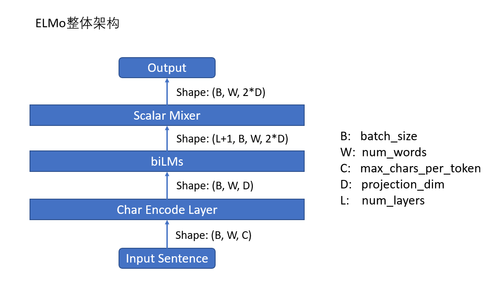

# Dynamic Word Embeddings

## 5 基于词向量的动态表征

在固定表征中，每个词都有一个固定的向量表示。但是在动态表征中，每个词的向量表示是根据上下文动态生成的。

### 5.1 ELMO
#### 5.1.1 ELMO模型结构
<figure><figcaption>
ELMO
</figcaption></figure>

输入的句子维度是$$B \times W \times C$$，其中$$B$$是batch size，$$W$$是句子长度，$$C$$是`max_characters_per_token`，即每个token的最大字符数，论文使用了固定值50。

经过Char Encoder Layer层后，输出的维度是$$B \times W \times D$$，其中$$D$$是`projection_dim`。ELMO是基于char的，所以会对每个单词内的所有char进行编码，得到这个单词的表示。Char Encoder Layer层输出一个句子在单词级别上的编码维度。

biLMs层是一个双向语言模型，分开训练了正向和反向的语言模型，而后将其特征进行拼接，最终得到的输出维度是$$(L+1) \times B \times W \times 2D$$，其中$$L$$是语言模型的层数，+1则是类似residual connection的操作，加上了初始的embedding层。

得到biLMs层的表征后，会经过一个混合层，会将前面的biLMs层的输出进行线性融合，得到最终的ELMO向量，维度为$$B \times W \times 2D$$。

#### 5.1.2 Char Encoder Layer
<figure><figcaption>
Char Encoder Layer
</figcaption></figure>

1. Char Embedding。在一个较小的char词表中进行编码。输入的维度是$$B \times W \times C$$，首先被reshape成$$B*W \times C$$，然后经过embedding层，得到的维度是$$B*W \times C \times d$$，其中$$d$$是字符级别的embeddding。
2. Multi-Scale。使用不同scale的卷积层，在宽度上进行拓展，即输入都是一样的，卷积的kernel_size和channel_size不同，用于捕捉不同n-grams之间的信息。
3. Concat。将m个不同维度的矩阵进行拼接，得到的维度是$$B*W \times m \times (d_1 + d_{2} + ... + d_{m})$$。
4. Highway层。全连接+残差。
5. Linear映射。将输出的维度映射到$$B \times W \times D$$。

#### 5.1.3 biLMs
ELMo主要是建立在biLMs（双向语言模型）上的。

给定一个有N个token的序列$$x = (t_1, t_2, ..., t_N)$$，biLMs的目标是最大化下面的概率：

$$
p(t_1, t_2, ..., t_N) = \prod_{i=1}^{N} p(t_i | t_1, t_2, ..., t_{i-1}; \theta)
$$
在每一个位置$$i$$，模型都会在每一层预测一个上下文相关的表征$$h_i^{LM}$$。顶层的输出$$h_i^{LM}$$会被用来预测下一个token的概率。

而反向的语言模型跟正向一样，只是输入是相反的。

<figure><figcaption>
biLMs
</figcaption></figure>

#### 5.1.4 EMLO代码实现
TODO

### 5.2 Bert
BERT Embedding由三种Embedding求和而成：

<figure><figcaption>
BERT Embedding
</figcaption></figure>

1. Token Embeddings：输入的句子首先会被分词，然后每个词会被映射到一个词向量。最初的词向量是随机初始化的，然后会在训练过程中通过优化目标（如Masked Language Model）进行调整。

2. Segment Embeddings：BERT是为了处理句子对任务而设计的，因此在输入的时候会加入句子对的信息。对于一个句子对，BERT会在输入的时候加入一个特殊的标记，用来区分两个句子。第一个句子的segment embedding是全0，第二个句子的segment embedding是全1。

3. Position Embeddings：BERT没有使用RNN或CNN，因此没有位置信息。为了加入位置信息，BERT使用了位置编码。位置编码是一个维度为$$d_{model}$$的向量，对于一个长度为$$L$$的句子，每个位置$$l$$都会有一个位置编码$$PE_l$$，然后将Token Embeddings、Segment Embeddings和Position Embeddings相加，得到最终的BERT Embedding。BERT使用的是交替三角函数的位置编码。

### 5.3 GPT
GPT是一个单向语言模型，输入的句子是从左到右的，因此在训练的时候，每个位置的词都可以看到前面的词，但是不能看到后面的词。

可以将BERT理解为Transformer的Encoder，而GPT可以理解为Transformer的Decoder。

## 参考资料
1. https://blog.csdn.net/Magical_Bubble/article/details/89160032
2. https://arxiv.org/pdf/1810.04805
3. https://zhuanlan.zhihu.com/p/403495863