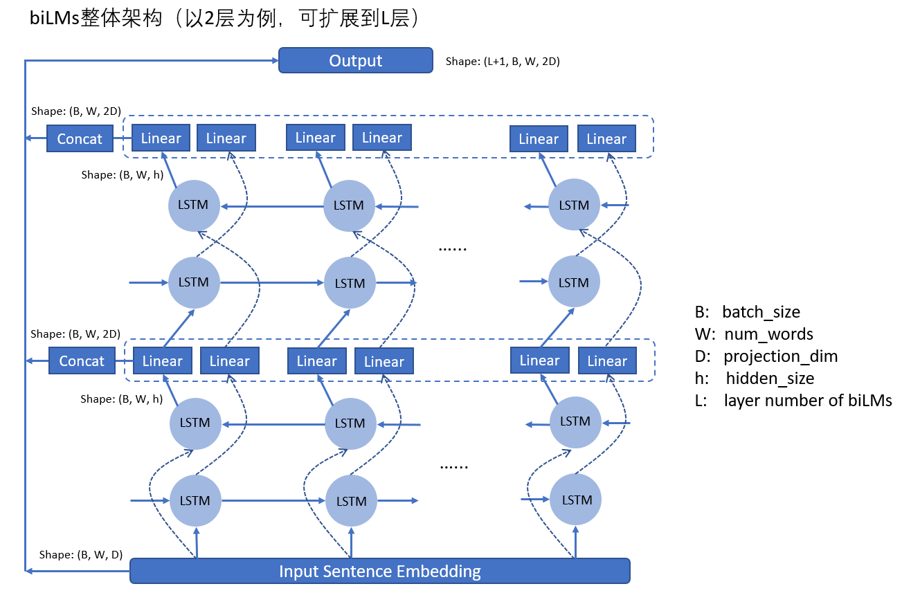

# ELMO

## 1 ELMO模型结构

<figure><figcaption><p>ELMO</p></figcaption></figure>

输入的句子维度是$$B \times W \times C$$，其中$$B$$是batch size，$$W$$是句子长度，$$C$$是`max_characters_per_token`，即每个token的最大字符数，论文使用了固定值50。

经过Char Encoder Layer层后，输出的维度是$$B \times W \times D$$，其中$$D$$是`projection_dim`。ELMO是基于char的，所以会对每个单词内的所有char进行编码，得到这个单词的表示。Char Encoder Layer层输出一个句子在单词级别上的编码维度。

biLMs层是一个双向语言模型，分开训练了正向和反向的语言模型，而后将其特征进行拼接，最终得到的输出维度是$$(L+1) \times B \times W \times 2D$$，其中$$L$$是语言模型的层数，+1则是类似residual connection的操作，加上了初始的embedding层。

得到biLMs层的表征后，会经过一个混合层，会将前面的biLMs层的输出进行线性融合，得到最终的ELMO向量，维度为$$B \times W \times 2D$$。

### 1.1 Char Encoder Layer

<figure><figcaption><p>Char Encoder Layer</p></figcaption></figure>

1. Char Embedding。在一个较小的char词表中进行编码。输入的维度是$$B \times W \times C$$，首先被reshape成$$B*W \times C$$，然后经过embedding层，得到的维度是$$B*W \times C \times d$$，其中$$d$$是字符级别的embeddding。
2. Multi-Scale。使用不同scale的卷积层，在宽度上进行拓展，即输入都是一样的，卷积的kernel\_size和channel\_size不同，用于捕捉不同n-grams之间的信息。
3. Concat。将m个不同维度的矩阵进行拼接，得到的维度是$$B*W \times m \times (d_1 + d_{2} + ... + d_{m})$$。
4. Highway层。全连接+残差。
5. Linear映射。将输出的维度映射到$$B \times W \times D$$。

### 1.2 biLMs

ELMo主要是建立在biLMs（双向语言模型）上的。

给定一个有N个token的序列$$x = (t_1, t_2, ..., t_N)$$，biLMs的目标是最大化下面的概率：

$$
p(t_1, t_2, ..., t_N) = \prod_{i=1}^{N} p(t_i | t_1, t_2, ..., t_{i-1}; \theta)
$$

在每一个位置$$i$$，模型都会在每一层预测一个上下文相关的表征$$h_i^{LM}$$。顶层的输出$$h_i^{LM}$$会被用来预测下一个token的概率。

而反向的语言模型跟正向一样，只是输入是相反的。

<figure><figcaption><p>biLMs</p></figcaption></figure>

## 2 ELMO两阶段

ELMO是一个两阶段过程：

第一阶段：利用biLMs语言模型训练。

第二阶段：做下游任务时，从预训练网络中提取对应单词的网络各层的Word Embedding作为新特征补充到下游任务中。

<figure><figcaption></figcaption></figure>

输入文本后分别可以的得到三个特征：

1. E1：单词特征
2. E2：句法特征
3. E3：语义特征

之后给这三个Embedding分别一个权重（可以通过学习获得），加权整合成一个Embedding，作为下游任务的输入。

ELMO缺点（与BERT和GPT对比）：

1. LSTM抽取特征的能力远弱于Transformer
2. 拼接方式双向融合特征融合能力偏弱

## 3 ELMO代码实现

```python
import torch.nn as nn

class ELMo(nn.Module):
    def __init__(self, vocab_size, embedding_dim, hidden_dim, num_layers):
        super(ELMo, self).__init__()
        self.embedding = nn.Embedding(vocab_size, embedding_dim)
        self.lstm = nn.LSTM(embedding_dim, hidden_dim, num_layers, bidirectional=True)
        self.linear = nn.Linear(hidden_dim * 2, vocab_size)

    def forward(self, x):
        x = self.embedding(x)
        x, _ = self.lstm(x)
        x = self.linear(x)
        return x

vocab_size = len(vocab)
embedding_dim = 100
hidden_dim = 128
num_layers = 2
model = ELMo(vocab_size, embedding_dim, hidden_dim, num_layers)
```

## 参考

1. [从Word Embedding到Bert模型—自然语言处理中的预训练技术发展史 - 知乎](https://zhuanlan.zhihu.com/p/49271699)
2. [https://blog.csdn.net/weixin\_42878111/article/details/131024910](https://blog.csdn.net/weixin_42878111/article/details/131024910)
3. [https://blog.csdn.net/Magical\_Bubble/article/details/89160032](https://blog.csdn.net/Magical_Bubble/article/details/89160032)


