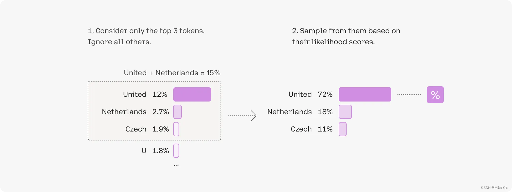

# GPT

### 1 GPT为什么叫GPT

GPT是一个单向语言模型，输入的句子是从左到右的，因此在训练的时候，每个位置的词都可以看到前面的词，但是不能看到后面的词。

GPT的全称是Generative Pre-trained Transformer。与 BERT 专注于“理解”不同，GPT 的目标是“生成”。可以将BERT理解为Transformer的Encoder，而GPT可以理解为Transformer的Decoder。

GPT也采用两阶段过程：

* 第一阶段使用LM进行预训练
* 第二阶段使用fine-tuning的方式处理下游任务

<figure><figcaption></figcaption></figure>

GPT使用的是单项的语言模型：严格的“从左到右”的预测模式，通过 Decoder 内部使用 **Masked Self-Attention** 实现。与 BERT 复杂的 MLM 策略（`[MASK]`, `random`, `unchanged`）不同，GPT 的训练目标更加简单。通过大量数据，使得模型能够深入学习语言的内在结构和逻辑，从而获得了更好的生成能力。

### 2 GPT Embedding

输入 embedding 由 **token embedding** 和 **position embedding** 相加得到。

* **Token Embedding**：
  * 与 BERT 相同，GPT 首先构建一个固定大小的词汇表
  * 使用输入的 `input_ids` 在词汇表矩阵中查找每个 token 对应的向量
  * 输出 shape 为 `[batch_size, seq_length, embedding_size]`
* **Position Embedding**：
  * **绝对位置信息**：GPT 需要知道每个 token 在序列中的绝对位置，以理解词序
  * **学习嵌入向量**：与 BERT 类似，GPT 的位置嵌入也是通过模型在预训练过程中**学习**得到的。模型会创建一个位置嵌入矩阵，大小为 `[max_position_embeddings, embedding_size]`，`max_position_embeddings` 通常是一个固定的最大序列长度。无论输入序列内容是什么，第一个 token 总是加上第一个位置的嵌入向量，第二个 token 总是加上第二个位置的嵌入向量，以此类推。

### 3 GPT代码实现

```python
import torch
import torch.nn as nn
from .transformer import TransformerBlock

class GPTEmbedding(nn.Module):
    """
    GPT Embedding which is consisted with Token and Position Embedding.
    """
    def __init__(self, vocab_size, embed_size, max_len=512, dropout=0.1):
        """
        :param vocab_size: total vocab size
        :param embed_size: embedding size of token embedding
        :param max_len: max sequence length
        """
        super().__init__()
        self.token = nn.Embedding(vocab_size, embed_size)
        self.position = nn.Embedding(max_len, embed_size)
        self.dropout = nn.Dropout(p=dropout)
        self.embed_size = embed_size

    def forward(self, sequence):
        # sequence: [batch_size, seq_length]
        batch_size, seq_len = sequence.size()
        
        # position_ids: [0, 1, 2, ..., seq_len-1] repeated for batch_size times
        position_ids = torch.arange(seq_len, dtype=torch.long, device=sequence.device)
        position_ids = position_ids.unsqueeze(0).expand_as(sequence)
        
        # Summing token and position embeddings
        token_embeddings = self.token(sequence)
        position_embeddings = self.position(position_ids)
        
        embedding = token_embeddings + position_embeddings
        return self.dropout(embedding)

class GPT(nn.Module):
    """
    GPT model: Generative Pre-trained Transformer.
    """

    def __init__(self, vocab_size, hidden=768, n_layers=12, attn_heads=12, dropout=0.1):
        """
        :param vocab_size: vocab_size of total words
        :param hidden: GPT model hidden size
        :param n_layers: numbers of Transformer blocks(layers)
        :param attn_heads: number of attention heads
        :param dropout: dropout rate
        """
        super().__init__()
        self.hidden = hidden
        self.n_layers = n_layers
        self.attn_heads = attn_heads

        # paper noted they used 4*hidden_size for ff_network_hidden_size
        self.feed_forward_hidden = hidden * 4

        # embedding for GPT, sum of positional and token embeddings
        self.embedding = GPTEmbedding(vocab_size=vocab_size, embed_size=hidden)

        # multi-layers transformer blocks, deep network
        # NOTE: TransformerBlock here is a Decoder-style block with Masked Self-Attention
        self.transformer_blocks = nn.ModuleList(
            [TransformerBlock(hidden, attn_heads, hidden * 4, dropout) for _ in range(n_layers)])
        
        # Final linear layer to project to vocab size
        self.output_layer = nn.Linear(hidden, vocab_size)

    def _make_causal_mask(self, seq_len, device):
        # Create a causal mask to prevent attending to future tokens.
        # The mask is a lower triangular matrix.
        # shape: [seq_len, seq_len]
        mask = torch.tril(torch.ones(seq_len, seq_len, device=device)).unsqueeze(0).unsqueeze(1)
        return mask == 0 # True for positions to be masked

    def forward(self, x):
        # x shape: [batch_size, seq_len]
        batch_size, seq_len = x.size()

        # attention masking for generative model (causal mask)
        # mask shape: [1, 1, seq_len, seq_len]
        mask = self._make_causal_mask(seq_len, x.device)

        # embedding the indexed sequence to sequence of vectors
        x = self.embedding(x)

        # running over multiple transformer blocks
        for transformer in self.transformer_blocks:
            # Here, the TransformerBlock's forward should accept a mask
            x = transformer.forward(x, mask)

        # Projecting the output of the last transformer block to the vocab space
        output = self.output_layer(x)
        
        # output shape: [batch_size, seq_len, vocab_size]
        return output
```

### 参考

1. [https://github.com/affjljoo3581/GPT2/blob/master/src/gpt2/modeling/transformer.py](https://github.com/affjljoo3581/GPT2/blob/master/src/gpt2/modeling/transformer.py)
2. [万字长文，带你搞懂什么是BERT模型（非常详细）看这一篇就够了！-CSDN博客](https://blog.csdn.net/star_nwe/article/details/143227601)
3. [https://arxiv.org/pdf/1810.04805](https://arxiv.org/pdf/1810.04805)
