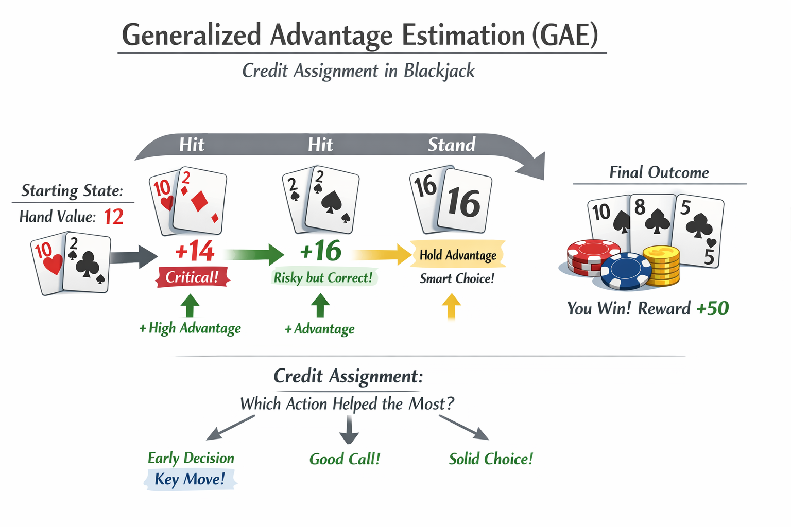

# Positional Encoding

在任何一门语言中，词语的位置和顺序对句子意思表达都是至关重要的。传统RNN模型天然有序，在处理句子时，以序列的模式逐个处理句子中的词语，这使得词语的顺序信息在处理过程中被天然的保存下来，并不需要额外的处理。

由于Transformer模型没有RNN或CNN的顺序结构，句子中的词语都是同时进入网络进行处理，所以没有明确的关于单词在源句子中位置的相对或绝对的信息。为了让模型理解序列中每个单词的位置/顺序，Transformer论文中提出了使用一种叫做 Positional Encoding（位置编码） 的技术。这种技术通过为每个单词添加一个额外的编码来表示它在序列中的位置，这样模型就能够理解单词在序列中的相对位置。

## 1 位置敏感性

位置敏感性（position-insensitive）的定义是：

* 如果模型的输出会随着输入文本数据顺序的变化而变化，那么这个模型就是关于位置敏感的，反之则是位置不敏感的。
  * RNN和textCNN是位置敏感的
  * 无位置编码的Transformer是位置不敏感的

Positional Encoding的引入，就是用来表征文本中词与词之间的顺序关系，解决Transformer的位置敏感性问题。

## 2 Positional Encoding的概念

Positional Encoding就是将位置信息嵌入到Embedding词向量中，让Transformer保留词向量的**位置信息**，可以提高模型对序列的理解能力。

理想的位置编码应该满足：

1. 为序列中每个位置的token输出唯一的编码
2. 不同长度的句子之间，任意两个字的差值应该保持一致
3. 外推性：编码值应该是有界的，应该能在不付出任何努力的条件下泛化到更长的句子中

## 3 Positional Encoding的分类

最朴素的想法是为每个token赋予一个数字，如第一个字为1，第二个字为2。

但是这个数字会随着文本长度变长而变得很大。在推理时，如果没有看过某个特定长度的样本，会导致外推性很弱。比如训练时长度为2K，用户输入是4K，可能会导致模型性能急剧下降。

### 3.1 可学习位置编码

`Learned Positional Embedding`方法直接对不同的位置随机初始化一个position embedding，加在word enbedding上输出模型，作为参数进行训练。

<figure><figcaption></figcaption></figure>

BERT使用的位置编码就是可学习位置编码。

**优点**

1. **灵活性高：**&#x80FD;适应特定任务的需求，无需人工设计规则

**缺点**

1. **外推性差：**&#x8BAD;练时的最大序列长度限制了推理时的外推能力。若测试文本远超训练长度，新增位置编码未经过训练，可能导致性能下降
2. **依赖海量数据：**&#x9700;要大量数据才能学习到有意义的编码，小数据集可能导致过拟合或编码无意义

### 3.2 sinusoidal位置编码

使用sin，cos交替创建positional encoding，用正余弦表示绝对位置，通过内积来表征相对位置。

$$
PE_{(pos, 2i)} = sin(\frac{pos}{10000^{\frac{2i}{d_{model}}}})
$$

$$
PE_{(pos, 2i+1)} = cos(\frac{pos}{10000^{\frac{2i}{d_{model}}}})
$$


pos代表token在序列中的位置，假设句子的长度为L，则 $$pos=0,1,\dots,L-1$$。i的范围可以从0取到 $$\frac {d_{model}}{2}$$，最终$$PE$$的维度和$$d_{model}$$一样。

$$
\begin{equation}\overrightarrow{PE}=\left[\begin{array}{c}\sin \left(\omega_1 \cdot pos\right) \\\cos \left(\omega_1 \cdot pos\right) \\\sin \left(\omega_2 \cdot pos\right) \\\cos \left(\omega_2 \cdot pos\right) \\\vdots \\\vdots \\\sin \left(\omega_{d / 2} \cdot pos\right) \\\cos \left(\omega_{d / 2} \cdot t\right)\end{array}\right]_{d \times 1}\end{equation}
$$

* `10000` 是一个经验值，其作用类似于**调节频率范围的超参**
  * 较小的分母会导致波长较短，**意味着相邻位置的编码差异剧烈，**&#x76F8;隔稍远的两个位置，其编码值已经几乎没有统计相关性，导致过度关注局部信息，难以建立长依赖
  * 较大的分母会导致波长较长，**意味着相邻 token 之间的位置编码差值非常小**，容易丢失局部细节

**为什么这样的正余弦的组合可以表示一个位置或者顺序？**

假设用一个二进制的形式表示数字：

<figure><figcaption></figcaption></figure>

可以观察到不同位之间变化的速度：最低位之间每个数字交替变化，第二低位每两个数字翻转一次。但是用二进制值会在浮点世界里造成空间浪费。所以反过来，我们可以使用它们对应的浮点连续值——三角函数。实际上，它们等价于交替变换的位。而且，通过降低它们的频率，我们也可以实现从红色的位走到橙色的位。

三角位置编码的另一个特性是，它允许模型毫无费力地把握相对位置。这是一段原论文的引用：

<figure><figcaption></figcaption></figure>

公式：

$$sin(\alpha+\beta)=sin\alpha \cdot cos\beta + cos\alpha\cdot sin\beta$$

$$cos(\alpha+\beta) = cos\alpha\cdot cos\beta - sin\alpha\cdot sin\beta$$

对于位置pos+k的positional encoding：

$$PE_{(pos+k, 2i)} = sin(w_{i}\cdot (pos+k)) = sin(w_{i}pos)cos(w_{i}k)+cos(w_{i}pos)sin(w_{i}k)$$

$$PE_{(pos+k, 2i+1)} = cos(w_{i}\cdot (pos+k)) = cos(w_{i}pos)cos(w_{i}k)-sin(w_{i}pos)sin(w_{i}k)$$

其中，$$w_{i} = \frac{1}{10000^{2i/d_{model}}}$$

则：

$$PE_{(pos+k, 2i)} = cos(w_{i}k)PE_{(pos, 2i)}+sin(w_{i}k)PE_{(pos, 2i+1)}$$

$$PE_{(pos+k, 2i+1)} = cos(w_{i}k)PE_{(pos,2i+1)}-sin(w_{i}k) PE_{(pos, 2i)}$$

因此：

$$\left [\begin{matrix} PE_{(pos+k,2i)} \\ PE_{(pos+k, 2i+1)} \end{matrix} \right]=\left [\begin{matrix} u & v \\ -v & u \end{matrix} \right]\times\left [\begin{matrix} PE_{(pos,2i)} \\ PE_{(pos, 2i+1)} \end{matrix} \right]$$

其中$$u = cos(w_{i}\cdot k), v = sin(w_{i} \cdot k)$$为常数

所以$$PE_{pos+k}$$可以被$$PE_{pos}$$线性表示

计算两者的内积，可以发现：

$$\begin{align} PE_{pos} \cdot PE_{pos+k} &= \sum_{i=0}^{\frac{d}{2}-1}sin(w_ipos)\cdot sin(w_i(pos+k)) + cos(w_ipos) \cdot cos(w_i(pos+k)) \\ &=\sum_{i=0}^{\frac{d}{2}-1} cos(w_i(pos-(pos+k)) \\ &=\sum_{i=0}^{\frac{d}{2}-1} cos(w_ik) \end{align}$$

内积会随着相对位置的递增而减小，从而表征位置的相对距离。

但是由于距离的对称性，虽然能反映相对位置的距离关系，但是无法区分方向。


**位置嵌入还有一种更直觉的解释，就是把它想象成一个钟（因为余弦和正弦就是单元圆的概念）。位置编码的每两个维度可以看成是钟的针（时针、分针、秒针等）。它们从一个位置移动到下一个位置就是在不同的频率下旋转它们的针。所以，尽管没有公式推导，它也能立刻告诉你为什么那个旋转矩阵存在。**

#### **3.2.1 正余弦位置编码的代码实现**

```python
import torch
import torch.nn as nn

class PositionalEncoding(nn.module):
	'''sincos'''
	def __init__(self, d_model, seq_len):
		super().__init__()
		
		# 和输入一样大小的维度
		self.encoding = torch.zeros(seq_len, d_model)
		# 不需要计算梯度
		self.encoding.requires_grad = False
		
		pos = torch.arrange(0, seq_len)
		pos = pos.float.unsqueeze(dim=1)

		_2i = torch.arange(0, d_model, step=2).float()

		self.encoding[:, 0::2] = torch.sin(pos / (10000 ** (_2i / d_model)))
    self.encoding[:, 1::2] = torch.cos(pos / (10000 ** (_2i / d_model)))

	def forward(self, x):
		batch_size, seq_len = x.size()
		return self.encoding[:seq_len, :]

class TokenEmbedding(nn.Embedding):
    """
    Token Embedding using torch.nn
    they will dense representation of word using weighted matrix
    """

    def __init__(self, vocab_size, d_model):
        """
        class for token embedding that included positional information
        :param vocab_size: size of vocabulary
        :param d_model: dimensions of model
        """
        super(TokenEmbedding, self).__init__(vocab_size, d_model, padding_idx=1)

class TransformerEmbedding(nn.Module):
    """
    token embedding + positional encoding (sinusoid)
    positional encoding can give positional information to network
    """

    def __init__(self, vocab_size, max_len, d_model, drop_prob, device):
        """
        class for word embedding that included positional information
        :param vocab_size: size of vocabulary
        :param d_model: dimensions of model
        """
        super(TransformerEmbedding, self).__init__()
        self.tok_emb = TokenEmbedding(vocab_size, d_model)
        self.pos_emb = PositionalEncoding(d_model, max_len, device)
        self.drop_out = nn.Dropout(p=drop_prob)

    def forward(self, x):
        tok_emb = self.tok_emb(x)
        pos_emb = self.pos_emb(x)
        return self.drop_out(tok_emb + pos_emb)
```

### **3.3 旋转位置编码RoPE**

RoPE主要借助了复数的思想

$$\begin{equation}\begin{aligned}\boldsymbol{q}_m & =f_q\left(\boldsymbol{x}_m, m\right) \\\boldsymbol{k}_n & =f_k\left(\boldsymbol{x}_n, n\right) \\\boldsymbol{v}_n & =f_v\left(\boldsymbol{x}_n, n\right)\end{aligned}\end{equation}$$

为了能利用上 token 之间的相对位置信息，假定query向量$$q_m$$和key向量$$k_n$$之间的内积操作，可以被一个函数$$g$$表示：

$$\begin{equation}<f_q\left(x_m, m\right), f_k\left(x_n, n\right)>=g\left(x_m, x_n, m-n\right)\end{equation}$$

* 左边是含有绝对位置信息的q和k，右边的输入是相对位置信息

假定现在词嵌入向量的维度是两维$$d=2$$，RoPE利用2维度平面上的向量的几何性质，再结合复数的性质，神奇般的找到了满足上述等式的$$f$$和$$g$$，其形式如下：

$$
\begin{equation}\begin{aligned}& f_q\left(\boldsymbol{x}_m, m\right)=\left(\boldsymbol{W}_q \boldsymbol{x}_m\right) e^{i m \theta} \\& f_k\left(\boldsymbol{x}_n, n\right)=\left(\boldsymbol{W}_k \boldsymbol{x}_n\right) e^{i n \theta} \\& g\left(\boldsymbol{x}_m, \boldsymbol{x}_n, m-n\right)=\operatorname{Re}\left[\left(\boldsymbol{W}_q \boldsymbol{x}_m\right)\left(\boldsymbol{W}_k \boldsymbol{x}_n\right)^* e^{i(m-n) \theta}\right]\end{aligned}\end{equation}
$$

这里面的 Re 表示复数的实部，推导后可以这样表示：

$$\begin{equation}\begin{aligned}f_q\left(\boldsymbol{x}_m, m\right) & =\left(\begin{array}{cc}\cos m \theta & -\sin m \theta) \\\sin m \theta & \cos m \theta\end{array}\right)\left(\begin{array}{ll}W_q^{(1,1)} & W_q^{(1,2)} \\W_q^{(2,1)} & W_q^{(2,2)}\end{array}\right)\binom{x_m^{(1)}}{x_m^{(2)}} \\& =\left(\begin{array}{cc}\cos m \theta & -\sin m \theta) \\\sin m \theta & \cos m \theta\end{array}\right)\binom{q_m^{(1)}}{q_m^{(2)}}\end{aligned}\end{equation}$$

同理，

$$
\begin{align*}
f_k(x_m, m) &= 
\begin{pmatrix}
\cos m\theta & -\sin m\theta \\
\sin m\theta & \cos m\theta
\end{pmatrix}
\begin{pmatrix}
W_k^{(1,1)} & W_k^{(1,2)} \\
W_k^{(2,1)} & W_k^{(2,2)}
\end{pmatrix}
\begin{pmatrix}
x_m^{(1)} \\
x_m^{(2)}
\end{pmatrix} \\
&= 
\begin{pmatrix}
\cos m\theta & -\sin m\theta \\
\sin m\theta & \cos m\theta
\end{pmatrix}
\begin{pmatrix}
k_m^{(1)} \\
k_m^{(2)}
\end{pmatrix}
\end{align*}
$$

最终，

$$\begin{align*} g(\mathbf{x}_m, \mathbf{x}_n, m - n) =  \begin{pmatrix} \mathbf{q}_m^{(1)} & \mathbf{q}_m^{(2)} \end{pmatrix} \begin{pmatrix} \cos((m - n)\theta) & -\sin((m - n)\theta) \\ \sin((m - n)\theta) & \cos((m - n)\theta) \end{pmatrix} \begin{pmatrix} k_n^{(1)} \\ k_n^{(2)} \end{pmatrix} \end{align*}$$$$\begin{align*} g(\mathbf{x}_m, \mathbf{x}_n, m - n) =  \begin{pmatrix} \mathbf{q}_m^{(1)} & \mathbf{q}_m^{(2)} \end{pmatrix} \begin{pmatrix} \cos((m - n)\theta) & -\sin((m - n)\theta) \\ \sin((m - n)\theta) & \cos((m - n)\theta) \end{pmatrix} \begin{pmatrix} k_n^{(1)} \\ k_n^{(2)} \end{pmatrix} \end{align*}$$

RoPe self-attention的计算步骤是：

<figure><figcaption></figcaption></figure>

1. 对于 token 序列中的每个词嵌入向量，首先计算其对应的 query 和 key 向量
2. 然后对每个 token 位置都计算对应的旋转位置编码
3. 接着对每个 token 位置的 query 和 key 向量的元素按照 两两一组 应用旋转变换
4. 最后再计算 query 和 key 之间的内积得到 self-attention 的计算结果

#### **3.3.1 旋转位置编码的代码实现**

```python
import torch
import torch.nn as nn
import torch.nn.functional as F
import math
 
 
def RoPE(q, k):
    # q,k: (bs, head, max_len, output_dim)
    batch_size = q.shape[0]
    nums_head = q.shape[1]
    max_len = q.shape[2]
    output_dim = q.shape[-1]
 
    # (bs, head, max_len, output_dim)
    pos_emb = sinusoidal_position_embedding(batch_size, nums_head, max_len, output_dim, q.device)
 
 
    # cos_pos,sin_pos: (bs, head, max_len, output_dim)
    # 看rope公式可知，相邻cos，sin之间是相同的，所以复制一遍。如(1,2,3)变成(1,1,2,2,3,3)
    cos_pos = pos_emb[...,  1::2].repeat_interleave(2, dim=-1)  # 将奇数列信息抽取出来也就是cos 拿出来并复制
    sin_pos = pos_emb[..., ::2].repeat_interleave(2, dim=-1)  # 将偶数列信息抽取出来也就是sin 拿出来并复制
 
    # q,k: (bs, head, max_len, output_dim)
    q2 = torch.stack([-q[..., 1::2], q[..., ::2]], dim=-1)
    q2 = q2.reshape(q.shape)  # reshape后就是正负交替了
 
    # 更新qw, *对应位置相乘
    q = q * cos_pos + q2 * sin_pos
 
    k2 = torch.stack([-k[..., 1::2], k[..., ::2]], dim=-1)
    k2 = k2.reshape(k.shape)
    # 更新kw, *对应位置相乘
    k = k * cos_pos + k2 * sin_pos
 
    return q, k
```

### 3.4 ALiBi

ALiBi全称是Attention with Linear Biases，线性偏差注意力。不像标准transformer那样，在embedding层添加位置编码，而是在softmax的结果后添加一个静态的不可学习的偏置项。也就是说，通过改变 **注意力机制的权重计算** 来实现对位置的记录。

<figure><figcaption></figcaption></figure>

传统注意力计算公式为：

$$\text{Attention}(Q, K, V) = \text{softmax}\left( \frac{QK^T}{\sqrt{d_k}} \right)V$$

加入 ALiBi 偏置后的注意力机制公式为：

$$\text{Attention}(Q, K, V) = \text{softmax}\left( \frac{QK^T}{\sqrt{d_k}} + b \right)V$$

$$b$$ 是一个与**每对 Query-Key 之间的相对距离相关的偏置矩阵。**

#### **3.4.1 偏置矩阵的构造方式**

1. 一个二维矩阵，其中第 $$(i,j)$$ 项表示第 $$i$$ 个token和第 $$j$$ 个token的相对距离
2. 对于每一个注意力头，指定一个斜率，越靠近的 token，其偏置越小，越远的 token，其偏置越大。
3. 整个偏置矩阵会被加到注意力 logits 上

#### 3.4.2 ALiBi的代码实现

```python
import torch

def build_alibi_bias(seq_len, num_heads):
    # 斜率的设定，通常用不同的值给不同头（这只是个例子）
    slopes = torch.tensor([-(2 ** (-i)) for i in range(num_heads)]).unsqueeze(1).unsqueeze(1)  # shape: (heads, 1, 1)

    # 构造相对距离矩阵 shape: (1, seq_len, seq_len)
    # entry [i][j] = j - i
    position_ids = torch.arange(seq_len).unsqueeze(0)
    relative_positions = position_ids - position_ids.T  # shape: (seq_len, seq_len)
    relative_positions = relative_positions.unsqueeze(0)  # (1, seq_len, seq_len)

    # 广播乘法，得到最终 bias：每个头一个
    alibi_bias = slopes * relative_positions  # shape: (heads, seq_len, seq_len)
    return alibi_bias

# 示例
num_heads = 4
seq_len = 6
alibi_bias = build_alibi_bias(seq_len, num_heads)
```

优点

* 不用对模型结构做任何更改

缺点

* 如果直接把位置外推到没见过的地方会导致模型灾难性崩溃

## 4 外推性问题

现如今很多大模型都开始支持超过4096长度的推理，例如GPT-4支持超过30k，ChatGLM2-6B也支持最长为32K的文本，但是由于显存资源的限制，这些大模型在真正在训练过程中不一定要训练这么长的文本，通常在预训练时只会设计到4k左右，因此如何确保在模型推理阶段可以支持远远超过预训练时的长度，是目前大模型的核心问题之一，我们将这一问题归为大模型的外推性。

训练和预测的长度不一致的问题，主要体现在两个方面：

* 预测的时候用到了没训练过的位置编码（不论是绝对位置还是相对位置）
* 预测的时候注意力机制所处理的token数量远超训练时的数量。

解决长文本外推性问题的一个简单有效的方法是Attention Mask，如图所示：

<figure><figcaption></figcaption></figure>

* 通过类似滑动窗口的结构，约束一个每个token只能对局部区域的token计算Attention值，因此对于相对位置大小不会超过窗口大小
* Attention只会在窗口内计算，避免了对大量的token的Attention进行加权平均导致最终权重过度“平滑”现象。

qk之后减去一个矩阵M，M的形状如下：

<figure><figcaption></figcaption></figure>

## 5 总结

* 为什么需要位置编码
* 什么是位置敏感性
* 理想的位置编码应该满足什么条件
* 常见的位置编码介绍一下
* 三角函数位置编码的公式
  * 为什么频率上要除以10000
  * 相对位置关系如何表征
* 手撕三角函数编码
* 为什么RoPe具有很强的外推性

### 参考

1. [https://www.xiaohongshu.com/explore/6646e1220000000005005675](https://www.xiaohongshu.com/explore/6646e1220000000005005675)
2. [【Transformer系列】深入浅出理解Positional Encoding位置编码-CSDN博客](https://blog.csdn.net/m0_37605642/article/details/132866365)
3. [深度探讨大模型位置编码及其外推性-CSDN博客](https://wjn1996.blog.csdn.net/article/details/131753251)
4. [Transformer架构：位置编码（sin/cos编码）\_transformer位置编码为啥用sin和cos-CSDN博客](https://blog.csdn.net/weixin_43406046/article/details/130745363)
5. [一文通透位置编码：从标准位置编码、旋转位置编码RoPE到ALiBi、LLaMA 2 Long(含NTK-aware简介)-CSDN博客](https://blog.csdn.net/v_JULY_v/article/details/134085503)


