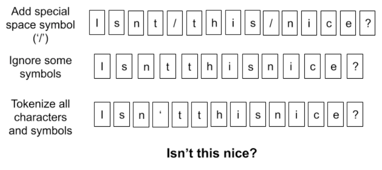

# Tokenizer

### 1 为什么LLM需要Tokenization

人类的幼崽在学会说话后，就已经有了对于这个世界的先验知识。比如，它知道“香蕉”是一种黄色的好吃的水果，它知道“水果”是什么，它能够利用已经学会的词汇解释新的词汇，它知道“香蕉”和“苹果”在潜在的表意空间中很接近。

但是，如果我们想要教会一个一无所知的机器去阅读文本、理解语义，我们是否还需要从单词开始教起？机器暂时还没有眼睛，所以我们无法拿着香蕉告诉它这是香蕉。但是，我们至少可以告诉它，“香蕉”是一个单独的词汇，这个句子应该这样读：“香蕉”是一种水果，而不是：香“蕉是”一种水果。

同时，我们希望尽可能多的告诉它人类语言的基本规律。

例如，“香蕉”可能经常和“苹果”一起出现（或者“牛奶”）。

对于没有任何语言结构知识的模型来说，直接输入一段文本无疑于输入一段乱码。

而我们希望像 BERT 或 GPT 这样的模型，在理解语义之前，首先需要在一个较低级别的层次上学习语法知识，这一点可以利用**特殊的结构设计**实现。

分词让我们更方便地做到以下两点：

* **将输入的长串文本转为更细粒度的划分，即token**
* **将输入转为向量，通过向量之间的关系表示词与词之间的关系，可以作为更高级别 NLP 任务（例如文本分类）的输入**

这样，使得输入的一段话，成为拥有上下文语义背景的一段话。例如：”香蕉是一种水果“。我们知道香蕉是什么，水果是什么（或者类似什么）。

### 2 分词粒度

在教会LLM说话之前，需要准备一个词表，要尽可能高效地表征人类语言的基础用法。因此，在评价分词粒度好坏的时候，一般是以下几个角度：

* 词表大小是否合适？
* 词表能否有效表征语义？

#### 2.1 字符级别

一个字母（英文）或者一个字（中文）就是一个字符，每个字符作为一个token。

<figure><figcaption>
字符级别
</figcaption></figure>

优点：

* 词表很小。像英文只有26个字符，中文用5000个常用汉字也能适用于大部分场景

缺点：

* 为每个字符学习嵌入向量时，每个向量容纳了太多的语义在内，表征能力不足
* 基本上没有利用词汇的边界信息和语义信息（然而对于中文来说一个字是有表意功能的，因此可以使用字符级别的分词，有时可能效果更好）
* 长文本需要一个超长的向量表示，容易遇到性能瓶颈

#### 2.2 word级别

对于英文及拉丁语系的语言来说，词与词之间有着天然的空格作为分割。而对于中文来说，词与词之间连在一起，需要首先经过分词算法。

优点：

* 符合人类的阅读习惯，保留了词汇的边界信息和语义信息

缺点：

* 由于**长尾效应**，词汇表可能过于庞大
* 词表中的低频词/稀疏词在模型训练过程中无法得到充分训练，进而模型不能充分理解这些词的语义
* 仍然有很多新词，容易OOV(Out-of-vocabulary)
* 不同词性的词，比如”banana”和“bananas”很难得到有效的表示（无法理解关联性）

#### 2.3 子词级别

subword/子词级，它介于字符和单词之间。是**当前最广泛的使用方法。**

统计每个词的词频。

1. 对于频率高的词，不进行拆分
2. 对于频率低的词，拆分成小的有意义的词
3. 对于后缀，一般前面会增加一个特殊标记，例如将`tokenization` 实际会拆成 `token` 和 `##ization` ，`##`标记`ization`是一个后缀

优点：

1. 用一个适量的词表大小几乎就可以表示所有词
2. 模型甚至可以理解没见过的词

缺点：

1. 无法解决单词拼写错误的问题

### 3 常用Tokenize算法

#### 3.1 BPE

**Byte Pair Encoding**

步骤：

1. 准备足够大的语料库C
2. 定义好需要的词表大小V\_size
3. 将单词拆分成字符序列，在每个单词末尾添加后缀\</w>，并统计单词频率
   1. 停止符\</w>表明subword是词后缀，如`st` 不加 `</w>` 可以出现在词首，如 `st ar`；加了 `</w>` 表明该子词位于词尾，如 `we st</w>`，二者意义截然不同
4. 将语料库中所有单词拆分为单个字符，用所有单个字符建立最初的词典，并统计每个字符的频率，本阶段的 subword 的粒度是字符
5. 挑出频次最高的符号对 ，比如说 t 和 h 组成的 th，将新字符加入词表，然后将语料中所有该字符对融合，即所有 t 和 h 都变为 th。新字符依然可以参与后续的 merge，有点类似哈夫曼树，BPE 实际上就是一种贪心算法
6. 重复5操作，直到词表中单词数达到设定量V\_size或下一个最高频数为 1

**例子**

1. 获取语料库，这样一段话为例：“ FloydHub is the fastest way to build, train and deploy deep learning models. Build deep learning models in the cloud. Train deep learning models. ”
2. 拆分，加后缀，统计词频：

