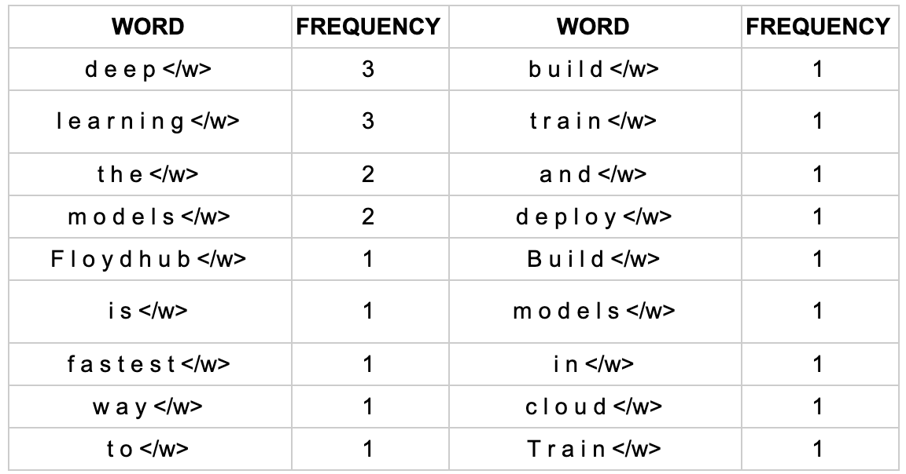
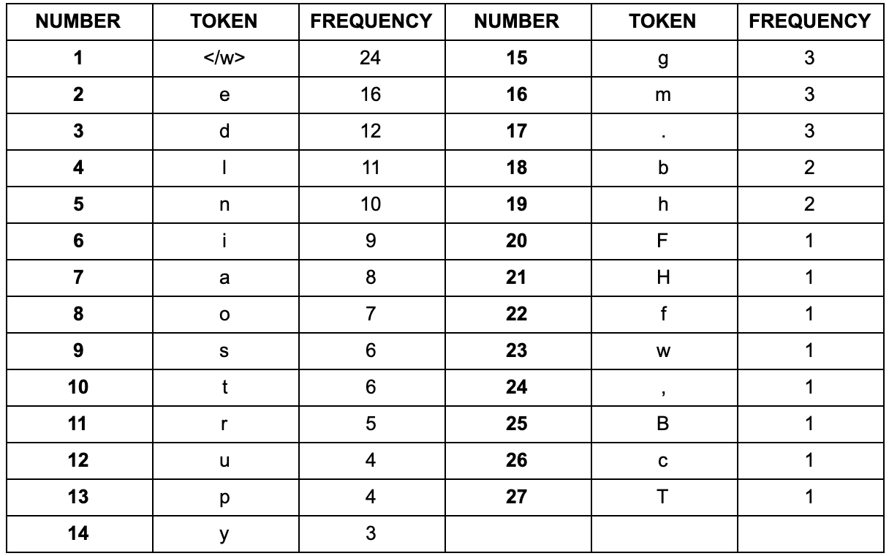
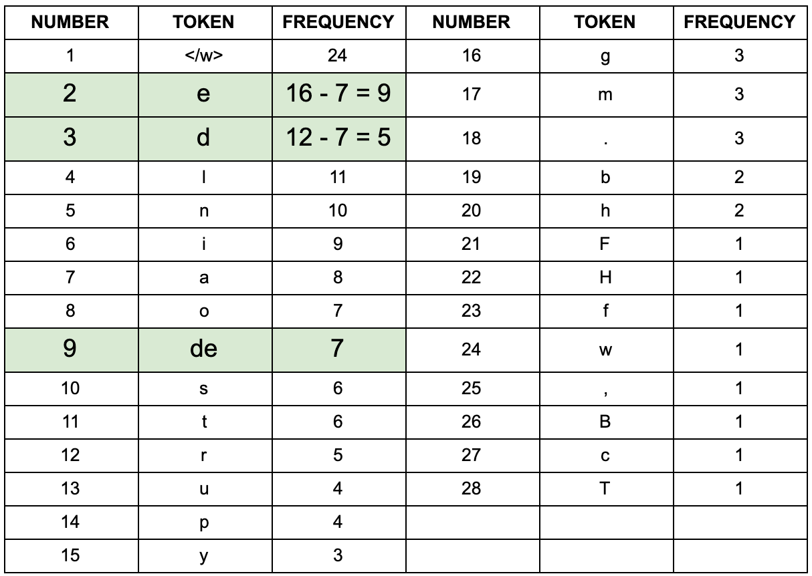
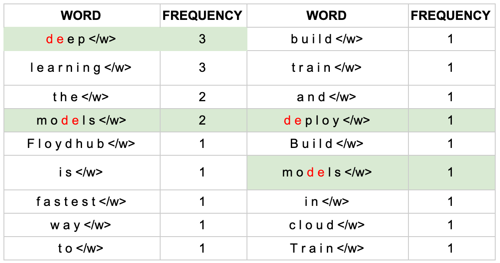
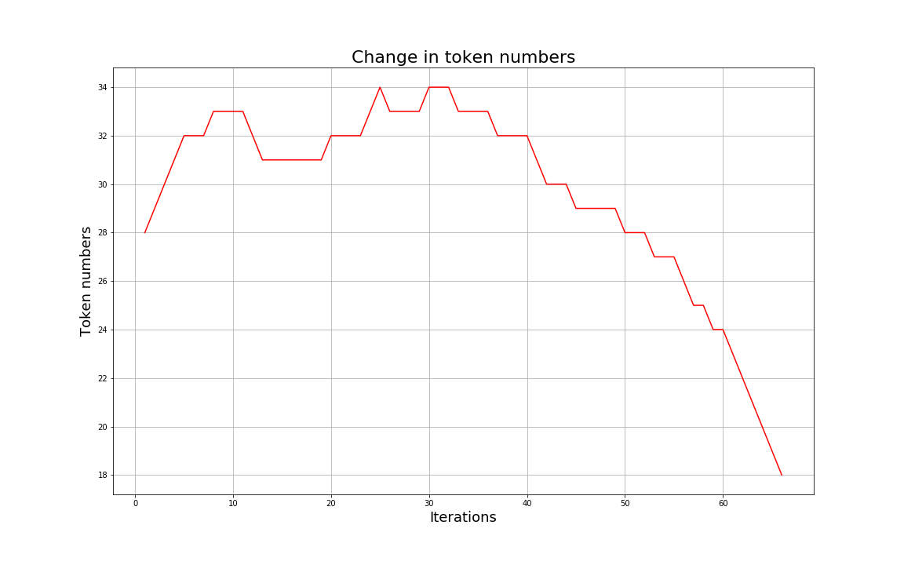

# Tokenizer

## 1 为什么LLM需要Tokenization

人类的幼崽在学会说话后，就已经有了对于这个世界的先验知识。比如，它知道“香蕉”是一种黄色的好吃的水果，它知道“水果”是什么，它能够利用已经学会的词汇解释新的词汇，它知道“香蕉”和“苹果”在潜在的表意空间中很接近。

但是，如果我们想要教会一个一无所知的机器去阅读文本、理解语义，我们是否还需要从单词开始教起？机器暂时还没有眼睛，所以我们无法拿着香蕉告诉它这是香蕉。但是，我们至少可以告诉它，“香蕉”是一个单独的词汇，这个句子应该这样读：“香蕉”是一种水果，而不是：香“蕉是”一种水果。

同时，我们希望尽可能多的告诉它人类语言的基本规律。

例如，“香蕉”可能经常和“苹果”一起出现（或者“牛奶”）。

对于没有任何语言结构知识的模型来说，直接输入一段文本无疑于输入一段乱码。

而我们希望像 BERT 或 GPT 这样的模型，在理解语义之前，首先需要在一个较低级别的层次上学习语法知识，这一点可以利用**特殊的结构设计**实现。

分词让我们更方便地做到以下两点：

* **将输入的长串文本转为更细粒度的划分，即token**
* **将输入转为向量，通过向量之间的关系表示词与词之间的关系，可以作为更高级别 NLP 任务（例如文本分类）的输入**

这样，使得输入的一段话，成为拥有上下文语义背景的一段话。例如：”香蕉是一种水果“。我们知道香蕉是什么，水果是什么（或者类似什么）。

## 2 分词粒度

在教会LLM说话之前，需要准备一个词表，要尽可能高效地表征人类语言的基础用法。因此，在评价分词粒度好坏的时候，一般是以下几个角度：

* 词表大小是否合适？
* 词表能否有效表征语义？

### 2.1 字符级别

一个字母（英文）或者一个字（中文）就是一个字符，每个字符作为一个token。

<figure><figcaption><p>字符级别</p></figcaption></figure>

优点：

* 词表很小。像英文只有26个字符，中文用5000个常用汉字也能适用于大部分场景

缺点：

* 为每个字符学习嵌入向量时，每个向量容纳了太多的语义在内，表征能力不足
* 基本上没有利用词汇的边界信息和语义信息（然而对于中文来说一个字是有表意功能的，因此可以使用字符级别的分词，有时可能效果更好）
* 长文本需要一个超长的向量表示，容易遇到性能瓶颈

### 2.2 word级别

对于英文及拉丁语系的语言来说，词与词之间有着天然的空格作为分割。而对于中文来说，词与词之间连在一起，需要首先经过分词算法。

优点：

* 符合人类的阅读习惯，保留了词汇的边界信息和语义信息

缺点：

* 由于**长尾效应**，词汇表可能过于庞大
* 词表中的低频词/稀疏词在模型训练过程中无法得到充分训练，进而模型不能充分理解这些词的语义
* 仍然有很多新词，容易OOV(Out-of-vocabulary)
* 不同词性的词，比如”banana”和“bananas”很难得到有效的表示（无法理解关联性）

### 2.3 子词级别

subword/子词级，它介于字符和单词之间。是**当前最广泛的使用方法。**

统计每个词的词频。

1. 对于频率高的词，不进行拆分
2. 对于频率低的词，拆分成小的有意义的词
3. 对于后缀，一般前面会增加一个特殊标记，例如将`tokenization` 实际会拆成 `token` 和 `##ization` ，`##`标记`ization`是一个后缀

优点：

1. 用一个适量的词表大小几乎就可以表示所有词
2. 模型甚至可以理解没见过的词

缺点：

1. 无法解决单词拼写错误的问题

## 3 常用Tokenize算法

### 3.1 BPE

#### **Byte Pair Encoding**

步骤：

1. 准备足够大的语料库C
2. 定义好需要的词表大小V\_size
3. 将单词拆分成字符序列，在每个单词末尾添加后缀\</w>，并统计单词频率
   1. 停止符\</w>表明subword是词后缀，如`st` 不加 `</w>` 可以出现在词首，如 `st ar`；加了 `</w>` 表明该子词位于词尾，如 `we st</w>`，二者意义截然不同
4. 将语料库中所有单词拆分为单个字符，用所有单个字符建立最初的词典，并统计每个字符的频率，本阶段的 subword 的粒度是字符
5. 挑出频次最高的符号对 ，比如说 t 和 h 组成的 th，将新字符加入词表，然后将语料中所有该字符对融合，即所有 t 和 h 都变为 th。新字符依然可以参与后续的 merge，有点类似哈夫曼树，BPE 实际上就是一种贪心算法
6. 重复5操作，直到词表中单词数达到设定量V\_size或下一个最高频数为 1

**例子**

1. 获取语料库，这样一段话为例：“ FloydHub is the fastest way to build, train and deploy deep learning models. Build deep learning models in the cloud. Train deep learning models. ”
2.  拆分，加后缀，统计词频：

    <figure><figcaption><p>词频</p></figcaption></figure>
3.  建立词表，统计字符频率，排序：

    <figure><figcaption><p>字符频率</p></figcaption></figure>
4.  以第一次迭代为例，将字符频率最高的`d`和`e`替换为`de`，后面依次迭代：

    <figure><figcaption><p>第一次迭代</p></figcaption></figure>
5.  更新词表

    <figure><figcaption><p>更新词表</p></figcaption></figure>

如果将词表大小设置为 10，最终的结果为：

```plaintext
d e
r n
rn i
rni n
rnin g</w>
o de
ode l
m odel
l o
l e
```

**优点**

* 可以很有效地平衡词典大小和编码步骤数。

随着合并的次数增加，词表大小通常先增加后减小。迭代次数太小，大部分还是字母，几乎就是字符级别的分词；迭代次数多，又变成了word级别的分词。所以词表大小要取一个中间值。

<figure><figcaption><p>词表大小变化</p></figcaption></figure>

BPE 一般适用在欧美语言拉丁语系中，因为欧美语言大多是字符形式，涉及前缀、后缀的单词比较多。而中文的汉字一般不用 BPE 进行编码，因为中文是字无法进行拆分。对中文的处理通常只有分词和分字两种。理论上分词效果更好，更好的区别语义。分字效率高、简洁，因为常用的字不过 5000 字，词表更加简短。

#### **Byte-level BPE**

* Byte-level BPE使用原始字节作为基本 token，能够表示任意文本，避免OOV的情况。
* 可以与各种文本编码兼容，确保广泛的适用性

**实现**

*   调包

    ```python
    from tokenizers import Tokenizer, models, pre_tokenizers, decoders, trainers, processors

    # Initialize a tokenizer
    tokenizer = Tokenizer(models.BPE())

    # Customize pre-tokenization and decoding
    tokenizer.pre_tokenizer = pre_tokenizers.ByteLevel(add_prefix_space=True)
    tokenizer.decoder = decoders.ByteLevel()
    tokenizer.post_processor = processors.ByteLevel(trim_offsets=True)

    # And then train
    trainer = trainers.BpeTrainer(
       vocab_size=20000,
       min_frequency=2,
       initial_alphabet=pre_tokenizers.ByteLevel.alphabet()
    )
    tokenizer.train([
       'toy_data.txt'
    ], trainer=trainer)

    # And Save it
    tokenizer.save("byte-level-bpe.tokenizer.json", pretty=True)
    ```
*   手撕

    ```python
    import re, collections

    # 获取词表，在后面加上</w>作为词的结束符
    def get_vocab(filename):
       vocab = collections.defaultdict(int)
       with open(filename, 'r', encoding='utf-8') as f:
          for line in f:
             words = line.strip().split()
             for word in words:
                vocab[' '.join(list(word)) + ' </w>'] += 1
       return vocab

    # 统计词频
    def get_stats(vocab):
       pairs = collections.defaultdict(int)
       for word, freq in vocab.items():
          symbols = word.split()
          for i in range(len(symbols)-1):
             pairs[symbols[i], symbols[i+1]] += freq
       return pairs

    # 合并词表
    def merge_vocab(pair, v_in):
       v_out = {}
       # 对特殊字符转义
       bigram = re.escape(' '.join(pair))
       # 对于每个词，将pair合并
       p = re.compile(r'(?<!\S)' + bigram + r'(?!\S)')
       for word in v_in:
          w_out = p.sub(''.join(pair), word) # 替换，不再出现空格
          v_out[w_out] = v_in[word]
       return v_out

    # 获取最终词表
    def get_tokens(vocab):
       tokens = collections.defaultdict(int)
       for word, freq in vocab.items():
          word_tokens = word.split()
          for token in word_tokens:
             tokens[token] += freq
       return tokens

    # 训练
    def train_bpe(filename, num_merges):
       vocab = get_vocab(filename)
       for i in range(num_merges):
          pairs = get_stats(vocab)
          if not pairs:
             break
          best = max(pairs, key=pairs.get)
          vocab = merge_vocab(best, vocab)
       tokens = get_tokens(vocab)
       return tokens
    ```

### 3.2 WordPiece

与BPE思想类似，WordPiece在开始时也是按照字符级别初始化一个词表。

最大的区别在于选择两个子词进行合并的规则： BPE 按频率，WordPiece 按能够使得 LM 概率最大的相邻子词加入词表

概率计算方式：

$$score = \frac{freq_{pair}}{freq_{first\_element} \times freq_{second\_element}}$$

WordPiece倾向于融合那些，各自的子部分在词表中更少出现的组合。

例如：尽管("un", "##able")出现的次数很多，但是WordPiece不会选择融合，因为有很多un和很多able在其它地方出现，保持它们的独立能够更好地表征语意。相反，像("hu", "##gging")这样的组合更容易被融合。

和BPE的另一个区别在于推理阶段的分词方式。 WordPiece最后仅仅保存最终的词表，而BPE保留了融合的规则。WordPiece会根据首字母找到最长的subword进行分割，而BPE则是根据保留的规则进行分割。 举个例子，对于`hugs`，最长的subword是`hug`，因此WordPiece会将其分割为`hug`和`s`，而BPE则会将其分割为`hu`和`gs`。

**实现**

*   调包

    ```python
    from tokenizers import Tokenizer, models, pre_tokenizers, decoders, trainers, processors

    # Initialize a tokenizer
    tokenizer = Tokenizer(models.WordPiece())

    # Customize pre-tokenization and decoding
    tokenizer.pre_tokenizer = pre_tokenizers.Whitespace()
    tokenizer.decoder = decoders.WordPiece()
    tokenizer.post_processor = processors.TemplateProcessing(
       single="<s> $A </s>",
       special_tokens=[
          ("<s>", 0),
          ("</s>", 1)
       ]
    )

    # And then train
    trainer = trainers.WordPieceTrainer(
       vocab_size=20000,
       min_frequency=2
    )
    tokenizer.train([
       'toy_data.txt'
    ], trainer=trainer)

    # And Save it
    tokenizer.save("wordpiece.tokenizer.json", pretty=True)
    ```
*   手撕

    ```python
    import re, collections


    # 获取词表
    def get_vocab(filename):
       vocab = collections.defaultdict(int)
       with open(filename, 'r', encoding='utf-8') as f:
          for line in f:
                words = line.strip().split()
                for word in words:
                   vocab[word] += 1
       return vocab

    vocab = get_vocab('README.md')
    print(vocab)


    # 获取alphabet
    def get_alphabet(vocab):
       alphabet = set()
       for word in vocab.keys():
          alphabet.add(word[0])
          for letter in word[1:]:
                alphabet.add(f"##{letter}") # 用##代表非首字母
       return alphabet

    alphabet = get_alphabet(vocab)
    print(alphabet)

    splits = {
       word: [c if i == 0 else f"##{c}" for i, c in enumerate(word)]
       for word in vocab.keys()
    }
    print(splits)


    def compute_pair_scores(splits):
       letter_freqs = collections.defaultdict(int)
       pair_freqs = collections.defaultdict(int)
       for word, freq in vocab.items():
          split = splits[word]
          if len(split) == 1:
                letter_freqs[split[0]] += freq
                continue
          for i in range(len(split) - 1):
                pair = (split[i], split[i+1])
                pair_freqs[pair] += freq
                letter_freqs[split[i]] += freq
          letter_freqs[split[-1]] += freq
       scores = {
          pair: freq / letter_freqs[pair[0]] / letter_freqs[pair[1]]
          for pair, freq in pair_freqs.items()
       }
       return scores

    pair_scores = compute_pair_scores(splits)
    print(pair_scores)

    def merge_pair(pair, splits):
       a, b = pair
       for word in vocab:
          split = splits[word]
          if len(split) == 1:
                continue
          i = 0
          while i < len(split) - 1:
                if split[i] == a and split[i + 1] == b:
                   merge = a + b[2:] if b.startswith("##") else a + b
                   split = split[:i] + [merge] + split[i + 2:]
                else:
                   i += 1
          splits[word] = split
       return splits

    def train(vocab, splits, vocab_size):
       while len(vocab) < vocab_size:
          pair_scores = compute_pair_scores(splits)
          best = max(pair_scores, key=pair_scores.get)
          if pair_scores[best] <= 1:
                break
          splits = merge_pair(best, splits)
          vocab = get_vocab(splits)
       return vocab, splits
    ```

### 3.3 Unigram

与BPE和WordPiece不同的是，Unigram的词表是从大到小变化的。 即先初始化一个大词表（可以用词频或者BPE初始化），根据评估准则不断丢弃词表，直到满足限定条件。Unigram 算法考虑了句子的不同分词可能，因而能够输出带概率的多个子词分段。 评判标准：Unigram loss 尝试删去一个 token，并计算对应的 unigram loss，删除使得 loss 增加最少的 token，因为它们可能是“最不被需要的”。 这个过程的计算量可能很大，所以我们可以一次移除p%的token，p是一个可以设置的超参，通常为10或20。 假设我们已经算得了词频：

```python
("hug", 10), ("pug", 5), ("pun", 12), ("bun", 4), ("hugs", 5)
```

并获得了所有substring

```python
["h", "u", "g", "hu", "ug", "p", "pu", "n", "un", "b", "bu", "s", "hug", "gs", "ugs"]
```

在Unigram模型中，我们假设每个token都是独立的，依据前面n个token推测第n+1个token的概率就是第n+1个token的概率。 概率则是由词频决定的，因此

$$
P(token) = \frac{freq(token)}{total\_freq}
$$

其中， $$total\_freq$$是所有token的词频之和。 给定一个单词，我们可以计算其概率：

$$
P(["p", "u", "g"]) = P("p") \times P("u") \times P("g")
$$

$$
P["pu", "g"] = P("pu") \times P("g")
$$

一个单词会被tokenize成概率最高的情况。

```python
["p", "u", "g"] : 0.000389
["p", "ug"] : 0.0022676
["pu", "g"] : 0.0022676
```

那么，"pug"会被分成"p"和"ug"或者"pu"和"g"。

loss计算

$$
loss = -\sum_{i=1}^{n} log(P(token_i))
$$

```python
"hug": ["hug"] (score 0.071428)
"pug": ["pu", "g"] (score 0.007710)
"pun": ["pu", "n"] (score 0.006168)
"bun": ["bu", "n"] (score 0.001451)
"hugs": ["hug", "s"] (score 0.001701)
```

所有loss是：

$$
10 * (-log(0.071428)) + 5 * (-log(0.007710)) + 12 * (-log(0.006168)) + 4 * (-log(0.001451)) + 5 * (-log(0.001701)) = 169.8
$$

我们需要计算移除每个token后对于loss的影响，然后移除使得loss增加最少的token。

实现

*   调包

    ```python
    from tokenizers import Tokenizer, models, pre_tokenizers, decoders, trainers, processors

    # Initialize a tokenizer
    tokenizer = Tokenizer(models.Unigram())

    # Customize pre-tokenization and decoding
    tokenizer.pre_tokenizer = pre_tokenizers.Whitespace()
    tokenizer.decoder = decoders.Unigram()

    # And then train
    trainer = trainers.UnigramTrainer(
       vocab_size=20000,
       min_frequency=2
    )
    tokenizer.train([
       'toy_data.txt'
    ], trainer=trainer)

    # And Save it
    tokenizer.save("unigram.tokenizer.json", pretty=True)
    ```
*   手撕

    ```python
    from math import log

    # 示例语料库
    corpus = [
       "This is the Hugging Face Course.",
       "This chapter is about tokenization.",
       "This section shows several tokenizer algorithms.",
       "Hopefully, you will be able to understand how they are trained and generate tokens."
    ]

    # 计算词频
    word_freqs = defaultdict(int)
    for text in corpus:
       words = text.split()
       for word in words:
          word_freqs[word] += 1

    # 初始化字符和子词频率
    char_freqs = defaultdict(int)
    subwords_freqs = defaultdict(int)

    for word, freq in word_freqs.items():
       for i in range(len(word)):
          char_freqs[word[i]] += freq
       for j in range(i + 2, len(word) + 1):
          subwords_freqs[word[i:j]] += freq

    # 排序并创建初始词汇
    sorted_subwords = sorted(subwords_freqs.items(), key=lambda x: x[1], reverse=True)
    token_freqs = list(char_freqs.items()) + sorted_subwords[:300 - len(char_freqs)]
    token_freqs = {token: freq for token, freq in token_freqs}

    # 计算概率模型
    total_sum = sum(freq for token, freq in token_freqs.items())
    model = {token: -log(freq / total_sum) for token, freq in token_freqs.items()}

    # Viterbi 算法进行标记化
    def encode_word(word, model):
       best_segmentations = [{"start": 0, "score": 1}] + [{"start": None, "score": None} for _ in range(len(word))]
       
       for start_idx in range(len(word)):
          best_score_at_start = best_segmentations[start_idx]["score"]
          for end_idx in range(start_idx + 1, len(word) + 1):
                token = word[start_idx:end_idx]
                if token in model and best_score_at_start is not None:
                   score = model[token] + best_score_at_start
                   if best_segmentations[end_idx]["score"] is None or best_segmentations[end_idx]["score"] > score:
                      best_segmentations[end_idx] = {"start": start_idx, "score": score}

       segmentation = best_segmentations[-1]
       if segmentation["score"] is None:
          return ["<unk>"], None

       start = segmentation["start"]
       end = len(word)
       tokens = []
       while start != 0:
          tokens.insert(0, word[start:end])
          next_start = best_segmentations[start]["start"]
          end = start
          start = next_start
       tokens.insert(0, word[start:end])
       return tokens, segmentation["score"]

    # 测试标记化
    print(encode_word("Hopefully", model))
    print(encode_word("This", model))
    ```

### 3.4 SentencePiece

BPE，WordPiece，Unigram的缺点：

* 假设输入文本使用空格来分隔单词，如果不是则需要提前分词

为了解决这个问题：

* SentencePiece将输入视为输入字节流，包括空格
* 然后使用 Byte-level BPE 或 unigram 算法来构建适当的词汇表

## 4 应用与实践：训练古汉语Tokenizer并与Qwen Tokenizer融合

### 4.1 为什么要词表拓展

* 词表拓展可以提高模型的泛化能力，使得模型能够处理更多的未知词汇
* 词表拓展可以提高模型的性能，使得模型能够更好地处理特定领域的文本

例如，Llama3的Tokenizer使用的是SentencePiece，词表大小为128256，且大部分是英文。如果用Llama3的Tokenizer处理古汉语文本，基本上都会退化成字节级别的分词，这样会导致丢失部分语义信息。

以《离骚》中的一句为例：

```plaintext
荃不查余之中情兮，反信谗而齌怒。
```

```
from transformers import AutoTokenizer
tokenizer = AutoTokenizer.from_pretrained(r'D:\Project\Meta-Llama-3-8B-Instruct', trust_remote_code=True)
print(len(tokenizer))
string = "荃不查余之中情兮，反信谗而齌怒。"
tokenized_string = tokenizer.tokenize(string)
tokenized_ids = tokenizer.convert_tokens_to_ids(tokenized_string)
tokenized_string_list = []
for token in tokenized_ids:
    tokenized_string_list.append(tokenizer.decode(token))
print(tokenized_string_list)
```

输出：

```plaintext
['�', '�', '不', '查', '余', '之', '中', '情', '�', '�', '，', '反', '信', '�', '�', '而', '�', '�', '怒', '。']
```

表现形式就是出现'�'。

如果我们需要训练一个古汉语专用的LLM（例如[XunziALLM](https://github.com/Xunzi-LLM-of-Chinese-classics/XunziALLM)），可能需要对它的Tokenizer进行拓展。

### 4.2 古汉语词表拓展

#### 4.2.1 准备语料

作为toy dataset，我们使用《离骚》全篇作为语料库，将其保存为`corpus.txt`。

#### 4.2.2 训练Tokenizer

```python
import time
import sentencepiece as spm

start_time = time.time()
spm.SentencePieceTrainer.train(
    input='corpus.txt',  # 输入文件
    model_prefix='lisao',  # 模型前缀
    shuffle_input_sentence=False,  # 是否打乱句子
    train_extremely_large_corpus=True,
    # hyperparameters of tokenizer
    max_sentence_length=16384,  # 句子最大长度
    pad_id=3,
    model_type="BPE",
    vocab_size=5000,
    split_digits=True,
    split_by_unicode_script=True,
    byte_fallback=True,
    allow_whitespace_only_pieces=True,
    remove_extra_whitespaces=False,
    normalization_rule_name="nfkc",
)

end_time = time.time()
print(end_time - start_time)
```

#### 4.2.3 与Llama3 Tokenizer融合

```python
from transformers import AutoTokenizer
import sentencepiece as spm

model_file = "lisao.model"

# 原生Llama3 Tokenizer
llama3_tokenizer = AutoTokenizer.from_pretrained(r'D:\Project\Meta-Llama-3-8B-Instruct', trust_remote_code=True)
# 自定义Tokenizer
lisao_tokenizer = spm.SentencePieceProcessor(model_file=model_file)

# print number of tokens
llama3_token_count = len(llama3_tokenizer)
lisao_token_count = lisao_tokenizer.GetPieceSize()
print(llama3_token_count, lisao_token_count)

# merge two tokenizers
llama3_token_set = set(llama3_tokenizer.get_vocab().keys())
print("Before merge:", len(llama3_token_set))

for i in range(lisao_token_count):
    token = lisao_tokenizer.id_to_piece(i)
    if token not in llama3_token_set:
        llama3_tokenizer.add_tokens(token)

llama3_token_set = set(llama3_tokenizer.get_vocab().keys())
print("After merge:", len(llama3_token_set))

# save the merged tokenizer
llama3_tokenizer.save_pretrained("lisao-llama3-tokenizer")
```

#### 4.2.4 性能测试

使用融合后的Tokenizer对《离骚》进行分词，输出为：

```
['荃不', '查余之中情', '兮', '，', '反信谗而', '�', '�', '怒', '。']
```

可以看到，'�'少了很多。

## 5 总结

* Transformer的输入是什么？
* Tokenize/分词的作用？
* 三种不同级别的Tokenizers及其优缺点
  * 字符级别
  * word级别
  * subword级别
* 四种Subword-based Tokenizers（拆分方法）
  * BPE/BBPE
  * WordPiece
  * Unigram
  * SentencePiece（使用BBPE或者Unigram）

## 6 参考资料

1. https://cloud.tencent.com/developer/article/2317900
2. https://jinhanlei.github.io/posts/Transformers快速入门-二-用Tokenizer从零开始训练词表/
3. https://huggingface.co/learn/nlp-course/chapter6
4. https://github.com/QwenLM/Qwen/blob/main/tokenization\_note\_zh.md
